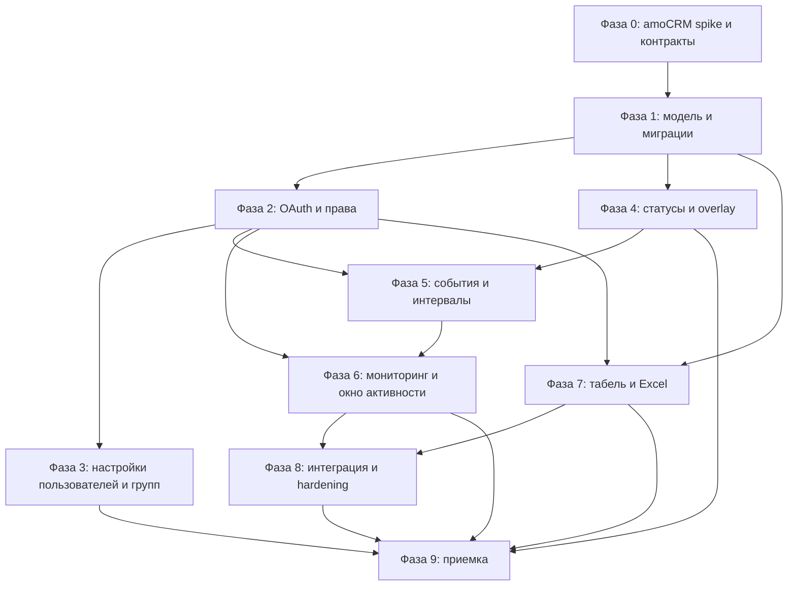

# Виджет «Табель» для amoCRM: план реализации

> **Для разработчиков и агентных исполнителей:** реализовывать план по фазам строго по порядку. После каждой фазы выполнить проверки, обновить этот файл, записать факт и только затем переходить к следующей фазе.

**Цель:** создать production-ready виджет учёта рабочего времени для amoCRM с настройками в интерфейсе подключения/настройки виджета, отдельными группами сотрудников, контролем доступа через права amoCRM, подтверждённой активностью из аналитики amoCRM и отчётами до 3 месяцев.

**Архитектура:** amoCRM Widget отвечает за пользовательский статус, блокирующий overlay и рабочую панель. Backend на FastAPI хранит настройки, группы, сотрудников, рабочие сессии, интервалы активности, события amoCRM и отчёты. Сервер проверяет права пользователя и получает данные amoCRM через OAuth/API/webhooks или согласованный механизм синхронизации. Настройки доступны только в интерфейсе настройки установленного виджета; рабочий экран настроек не показывает.

**Технологии:** Python 3.11+, FastAPI, SQLAlchemy, Alembic, PostgreSQL 15, Pydantic, openpyxl, amoCRM Widget SDK, vanilla JavaScript/HTML/CSS, pytest, Docker Compose.

## Глобальные ограничения и правила

- Доступ к настройкам и возможностям определяется правами пользователя в amoCRM; backend обязан повторно проверять права и не доверять только клиентскому интерфейсу.
- Группы создаются внутри виджета отдельно от отделов amoCRM.
- Группу создаёт администратор; руководитель определяется по роли пользователя в amoCRM и закрепляется за группой настройками администратора.
- Один сотрудник может состоять только в одной группе.
- Администратор видит все включённые группы и сотрудников; руководитель видит только свою группу и себя; сотрудник видит только свой статус и кнопки управления.
- Вкладки настройки виджета: «Настройки» и «Пользователи». Вкладки «Оплата» и «Выданные доступы» не реализуются.
- Во вкладке «Пользователи» загружаются пользователи amoCRM, есть поиск, выбор «Учитывать рабочее время» и выбор «Скрыть виджет».
- «Учитывать рабочее время» включает сотрудника в автоматический табель и отчёты. «Скрыть виджет» убирает рабочий интерфейс и кнопки, но не исключает сотрудника из учёта.
- Рабочие статусы: «Работаю», «Перерыв», «Закончил(а)». После «Закончил(а)» повторный запуск в тот же день возможен только с разрешения администратора.
- В статусе «Работаю» amoCRM доступна. В статусах «Перерыв» и «Закончил(а)» интерфейс затемняется тёмным полупрозрачным overlay и блокируется; остаются только допустимые кнопки.
- Активность учитывается только во время статуса «Работаю».
- Порог отсутствия действий — 5 минут. Действия мышью и клавиатурой сами по себе не считаются рабочим временем и отображаются как интервал «без подтверждённой работы», если не привели к событию amoCRM.
- В подтверждённую активность входят полный доступный перечень событий стандартной аналитики amoCRM и звонки. Обычный клик/ввод без события amoCRM не считается активностью.
- Временная шкала показывает отдельные интервалы работы над задачами/объектами. Длина интервала отражает рассчитанное или фактическое время; источник длительности обязан быть указан.
- Окно сотрудников имеет обычный и полноэкранный режим. Напротив каждого сотрудника есть кнопка открытия активности за 7 дней.
- Активность в интерфейсе отображается зелёными полосками; наведение показывает дату/время, тип, объект, описание, звонок, длительность и ссылку на карточку, если они есть. Пустые участки показывают отсутствие подтверждённой активности.
- Excel содержит табельные поля, но не содержит активность и CRM-события.
- Отчётный период ограничен 3 месяцами на backend, независимо от UI.
- Все даты хранятся в UTC, отображаются в часовом поясе группы. Для каждой группы задаются часовой пояс, начало и конец рабочего дня.
- Ошибки для пользователя формулируются простым русским языком. Технические детали пишутся в структурированные серверные логи с correlation/request ID; секреты и токены в логи не попадают.
- После каждой фазы обновляются разделы «Статус фаз», «Таблица прогресса», «Что сделано», «Что можно проверить», «Блокеры» и журнал изменений этого файла.

## Как работать по плану

1. Перед началом фазы проверить статус предыдущей фазы и зависимости.
2. Для каждой задачи сначала написать тест или проверочный сценарий, который может выявить ошибку.
3. Выполнить реализацию минимально необходимым объёмом, затем запустить узкие проверки и общие проверки фазы.
4. Не закрывать фазу по сообщению агента без проверки diff, тестов и критериев готовности.
5. После фазы обновить этот файл: отметить чекбоксы, заполнить факт, указать созданные/изменённые файлы, результаты проверок и доступный ручной сценарий.
6. Если фаза заблокирована, остановиться, записать причину простыми словами в русский раздел «Блокеры» и не отмечать её выполненной.

## Статус фаз

| Фаза | Название | Статус | Дата | Проверка |
|---:|---|---|---|---|
| 0 | Контракт и технический spike amoCRM | Выполнена с подтверждёнными ограничениями | 2026-09-16 | `pytest -q`: 110 passed; live OAuth/account/users/rights/refresh и 7 типов событий проверены; calls/UI-iframe ограничены |
| 1 | Единая модель данных и миграции | Выполнена | 2026-09-18 | `pytest -q`: 143 passed; 29 точечных unit-тестов прошли при независимом review; PostgreSQL upgrade/downgrade: 4 passed; одна голова `005` |
| 2 | OAuth, синхронизация пользователей и права | Выполнена | 2026-09-19 | `pytest`: 248 passed, 10 skipped; PostgreSQL migrations: 10 passed; независимый entry-gate review: PASS; одна голова `009` |
| 3 | Настройки amoMarket: пользователи и группы | Локально реализована; live gate отложен | 2026-09-22 | Локально: backend `369 passed`, Node `39 passed`, PostgreSQL migrations `15 passed`, package tests `12 passed`, `010 (head)`, ZIP `16` файлов; complete live amoCRM smoke и детальная приёмка отложены до локальной реализации всех фаз |
| 4 | Рабочие статусы и блокирующий интерфейс | В работе: проектирование и baseline | 2026-09-22 | Текущий backend baseline: `350 passed`, `18 skipped`, `1 failed` на границе локальной и UTC-даты; причина установлена, исправление ещё не внесено |
| 5 | Источник событий amoCRM и активность | Не начата | — | — |
| 6 | API мониторинга и окно активности | Не начата | — | — |
| 7 | Табель, отчёты и Excel | Не начата | — | — |
| 8 | Интеграция, безопасность и производительность | Не начата | — | — |
| 9 | Приёмка и документация | Не начата | — | — |

## Таблица прогресса

| План | Факт | Статус | Блокеры |
|---|---|---|---|
| Проверить доступность API событий аналитики amoCRM и звонков | Live OAuth/refresh подтверждены; создан controlled `[TEST CODEX]` набор; наблюдались 7 типов/11 событий и реальные field shapes; `/api/v4/calls` вернул 405 | Выполнено с ограничениями | Полный каталог, реальные звонки, общая latency/pagination и iframe-поведение не подтверждены; используется явный `unavailable` fallback |
| Выровнять существующие модели, сервисы и API | Модели, схемы и подключённые маршруты используют verified request context, account scope и policy-фильтрацию | Выполнено | Нет |
| Ввести отдельные группы виджета и уникальность группы сотрудника | Добавлены `WidgetGroup`/`GroupMember`; PostgreSQL запрещает второе активное членство в пределах аккаунта и сохраняет историю неактивных членств | Выполнено | Нет; чистый и заполненный цикл миграций проверен на PostgreSQL |
| Реализовать настройки «Учитывать» и «Скрыть» | `frontend/settings/*`, `widget/script.js`, `backend/app/api/v1/settings.py`, `settings_snapshot_service.py`; локальный DOM smoke и API-тесты прошли | Локально выполнено, live gate открыт | Проверить реальный `onSave`/`$authorizedAjax` в amoCRM и схему persistent БД со старой `010` |
| Реализовать статусы и overlay | Не выполнено | Не начато | Нужен стабильный контракт сессий |
| Получать полный перечень событий аналитики и звонки | Не выполнено | Не начато | Ограничения amoCRM требуют spike |
| Реализовать интервалы с порогом 5 минут | Единая модель и правила источников готовы: подтверждённый интервал создаётся только во время `Работаю`; порог и сбор событий остаются фазой 5 | Частично выполнено по плану | Зависит от источника событий фазы 5 |
| Реализовать мониторинг по ролям и активность за 7 дней | Не выполнено | Не начато | Зависит от RBAC и activity API |
| Реализовать табель до 3 месяцев и Excel без активности | Не выполнено | Не начато | Зависит от отчётной модели |
| Провести end-to-end приёмку | Не выполнено | Не начато | Все предыдущие фазы |

## Фаза 0. Контракт и технический spike amoCRM

**Готовое состояние:** зафиксированы проверенные возможности amoCRM, единый API-контракт и список ограничений. Разработка не зависит от догадок о том, можно ли получить события аналитики, звонки, пользователя и его права.

**Задачи:**

- [x] Составить таблицу требований из этого плана и текущего кода в `docs/requirements-matrix.md`.
- [x] Проверить manifest и доступные locations/scopes для установленного виджета в `widget/manifest.json`.
- [x] Проверить, как amoCRM передаёт OAuth authorization code, refresh token, account ID, user ID и роли; неподтверждённое role mapping явно вынесено в фазу 2.
- [x] Проверить API/аналитику событий: наблюдаемые типы, автора, timestamp, сущность, ссылки и pagination metadata; полный каталог и общие гарантии помечены недоступными до появления соответствующих действий.
- [x] Проверить API звонков: reader endpoint вернул 405; направление, длительность, автор и карточка помечены `unavailable`, а не выдуманы.
- [x] Проверить границу мыши/клавиатуры: browser input не считается подтверждённой активностью без CRM-события; реальная iframe-граница оставлена как ограничение widget UI.
- [x] Описать fallback, если API amoCRM не отдаёт отдельное поле или событие, в `docs/amocrm-integration-limits.md`.
- [x] Зафиксировать JSON-контракты: `GET /me`, `GET /settings`, status transitions, team, timeline, report, export.

**Файлы:**

- Create: `docs/requirements-matrix.md`
- Create: `docs/amocrm-integration-limits.md`
- Create: `docs/api-contract.md`
- Modify: `widget/manifest.json`
- Test: `backend/tests/integration/test_amocrm_contract.py`

**Проверки:** контрактные тесты с mock-ответами amoCRM; ручной spike в тестовом аккаунте; отрицательная проверка отсутствующего/просроченного токена.

**Критерии готовности:** нет неизвестных полей, от которых зависит следующая фаза; явно отмечено, какие события реально доступны; при невозможности получить событие есть согласованный статус «данные недоступны», а не выдуманное событие.

## Фаза 1. Единая модель данных и миграции

**Готовое состояние:** backend запускается на одной согласованной модели без рассинхрона `id/status/account_id`; миграции воспроизводятся с пустой базы; доменные правила имеют unit-тесты.

**Задачи:**

- [x] Зафиксировать идентификаторы: внутренний `User.id`, `amocrm_user_id`, `amocrm_account_id`; убрать доверие к клиентскому внутреннему ID.
- [x] Создать/обновить модели `User`, `WidgetSettings`, `WidgetGroup`, `GroupMember`, `WorkSession`, `StatusTransition`, `ActivityInterval`, `CrmEvent`, `CallEvent`, `WorkComment`.
- [x] Добавить группе `timezone`, `work_start_time`, `work_end_time`, `is_active`.
- [x] Добавить уникальное ограничение одного активного членства сотрудника в одной группе.
- [x] Разделить `active_duration`, `unconfirmed_duration`, `break_duration` и `idle_duration`.
- [x] Добавить источник интервала: `crm_event`, `call`, `unconfirmed_input`; незарегистрированные клики не записывать как CRM activity.
- [x] Создать последовательную миграцию после текущей цепочки и проверить upgrade/downgrade на копии БД.
- [x] Выровнять сервисы и схемы с фактическими полями; удалить или переписать обращения к отсутствующим `WorkSession.account_id`, `status`, `session_id`, `WorkComment.session_id`.

**Файлы:**

- Create/modify: `backend/app/models/*.py`
- Create: `backend/app/models/widget_group.py`, `group_member.py`, `activity_interval.py`, `crm_event.py`, `call_event.py`
- Modify: `backend/app/schemas/*.py`, `backend/app/services/*.py`
- Create: `backend/migrations/versions/<next>_timesheet_v2.py`
- Test: `backend/tests/unit/test_models.py`, `test_interval_rules.py`, `backend/tests/integration/test_migrations.py`

**Критерии готовности:** новая база поднимается миграциями; повторное добавление сотрудника во вторую группу отклоняется; нельзя создать activity interval вне `Работаю`; тесты модели проходят.

## Фаза 2. OAuth, синхронизация пользователей и права

**Готовое состояние:** backend знает пользователя и аккаунт через проверенный amoCRM OAuth, синхронизирует пользователей, а каждый API-ответ фильтруется по правам amoCRM и группе виджета.

**Задачи:**

- [x] Создать `backend/app/integrations/amocrm_client.py` с timeout, retry для временных ошибок, rate-limit обработкой и безопасным логированием.
- [x] Создать `backend/app/integrations/oauth.py` для authorization code, refresh token и шифрования/маскировки токенов.
- [x] Создать `backend/app/services/user_sync_service.py` для users, ролей, имени, email, avatar и account metadata.
- [x] Создать `backend/app/core/access_policy.py`: employee/manager/admin, проверка видимости группы и сотрудника.
- [x] Заменить доверенные заголовки `X-User-Id`/`X-Account-Id` на проверенный контекст запроса; оставить заголовки только как тестовый adapter.
- [x] Синхронизировать изменения состава пользователей без удаления истории табеля.
- [x] Добавить 401/403/404/409/429 тесты и проверку прямого запроса РОП к чужой группе.

**Файлы:**

- Create: `backend/app/integrations/amocrm_client.py`, `oauth.py`
- Create: `backend/app/services/user_sync_service.py`, `access_service.py`
- Create/modify: `backend/app/core/access_policy.py`, `backend/app/core/security.py`
- Modify: `backend/app/api/v1/dependencies.py`, all protected endpoints
- Test: `backend/tests/integration/test_oauth.py`, `test_access_policy.py`, `test_user_sync.py`

**Критерии готовности:** сотрудник получает только свой контекст; руководитель только свою группу; администратор все включённые группы; подмена ID в запросе не расширяет доступ.

## Фаза 3. Настройки amoMarket: пользователи и группы

**Готовое состояние:** при открытии установленного виджета в настройках доступны только вкладки «Настройки» и «Пользователи». Администратор включает учёт, скрывает рабочий UI, создаёт группы и задаёт расписание.

**Задачи:**

- [x] Переписать `widget/manifest.json` под фактически поддерживаемые поля settings/advanced settings и права amoCRM.
- [x] Разделить callbacks `settings`, `advancedSettings`, `onSave` и рабочий `init`; рабочий `init` не рендерит редактор настроек.
- [x] Создать `frontend/settings/settings.html`, `settings.js`, `settings.css` или адаптировать существующую admin-панель без вкладок оплаты и выданных доступов.
- [x] Реализовать вкладку «Пользователи»: список amoCRM, поиск, amoCRM-группировка, `Учитывать рабочее время`, `Скрыть виджет`, группа сотрудника и сохранение.
- [x] Реализовать вкладку «Настройки»: телефон поддержки, статусы, редактор групп, руководитель, часовой пояс, начало/конец дня, разрешение повторного запуска.
- [x] Запретить сохранение включённого сотрудника без группы; не позволять назначить сотрудника в две группы.
- [x] Обеспечить идемпотентное сохранение и восстановление данных после перезагрузки.

**Файлы:**

- Modify: `widget/manifest.json`, `widget/script.js`, `widget/styles.css`
- Create/modify: `frontend/settings/settings.html`, `frontend/settings/settings.js`, `frontend/settings/settings.css`
- Create/modify: `backend/app/api/v1/settings.py`, `backend/app/api/v1/users.py`, `backend/app/api/v1/groups.py`
- Test: `backend/tests/api/test_settings.py`, `test_groups.py`; browser smoke tests `frontend/tests/settings.spec.js`

**Критерии готовности:** настройки сохраняются только у пользователя с нужным правом amoCRM; «Скрыть» не выключает учёт; один сотрудник имеет максимум одну группу; настройки отсутствуют в рабочем интерфейсе.

## Фаза 4. Рабочие статусы и блокирующий интерфейс

**Baseline 2026-09-22:** общий backend-прогон дал `350 passed`, `18 skipped`, `1 failed` в `test_legacy_consumers_query_canonical_fields_and_correct_account`: старая KPI-логика определяет «сегодня» по локальной дате компьютера, а сессия хранит время в UTC. При переходе местной даты раньше UTC-даты тест получает ноль вместо часа. Это открытая задача фазы, а не пройденная проверка.

**Готовое состояние:** сотрудник может менять только собственный статус, backend корректно считает рабочий день/перерывы/опоздание, а overlay блокирует amoCRM в нерабочих состояниях.

**Задачи:**

- [ ] Создать доменный автомат переходов: `BEFORE_WORKDAY -> WORKING -> BREAK -> WORKING -> FINISHED`; повтор `FINISHED -> WORKING` только по разрешению администратора.
- [ ] Реализовать idempotency key для кнопок, защиту двойного клика и конфликтов вкладок.
- [ ] Рассчитывать начало/конец дня, опоздание и длительность по часовому поясу группы, хранить timestamps в UTC.
- [ ] Вынести overlay из дублирующего inline CSS и применить namespace классов виджета.
- [ ] Реализовать состояния `Работаю`, `Перерыв`, `Закончил(а)`, включая затемнение и только допустимые кнопки.
- [ ] Для скрытого пользователя не показывать UI, но продолжать серверный учёт.
- [ ] Убрать demo fallback, который создаёт видимость работы при недоступном backend; показывать русское сообщение об ошибке и безопасное состояние.

**Файлы:**

- Create/modify: `backend/app/services/timesheet_service.py`, `backend/app/api/v1/sessions.py`
- Modify: `backend/app/models/work_session.py`, `status_transition.py`
- Create/modify: `widget/script.js`, `widget/styles.css`, `widget/overlay.js`
- Test: `backend/tests/unit/test_timesheet_transitions.py`, `test_timezone_schedule.py`, `backend/tests/api/test_sessions.py`
- Browser tests: `frontend/tests/overlay.spec.js`

**Критерии готовности:** все переходы и запреты покрыты тестами; overlay нельзя обойти кликом; сбой backend не переводит пользователя в ложный `Работаю`; повторный запуск требует админского разрешения.

## Фаза 5. Источник событий amoCRM и активность

**Готовое состояние:** backend получает доступные аналитические события и звонки, связывает их с пользователем и рабочей сессией, строит интервалы с порогом 5 минут и различает подтверждённую работу и действия без результата.

**Задачи:**

- [ ] Реализовать ingestion webhook/polling согласно результатам фазы 0; хранить raw payload для диагностики с ограниченным сроком хранения.
- [ ] Создать нормализатор полного справочника событий amoCRM с неизвестным типом `unknown`, не теряя исходный payload.
- [ ] Создать нормализатор звонков: направление, длительность, автор, связанная карточка.
- [ ] Ввести deduplication по account/event ID/source/timestamp.
- [ ] Реализовать клиентский буфер действий только для определения интервала присутствия; не записывать каждый клик/символ.
- [ ] Закрывать интервал после 5 минут отсутствия действий; действия без события amoCRM помечать `unconfirmed_input` и не включать в подтверждённое рабочее время.
- [ ] Связывать CRM-событие с ближайшим интервалом `Работаю`; события в `BREAK`/`FINISHED` не включать в activity.
- [ ] Для звонка использовать фактическую длительность; для остальных событий хранить `duration_source=calculated` только когда расчёт обоснован, иначе показывать точку/минимальный интервал без выдуманной длительности.

**Файлы:**

- Create: `backend/app/services/event_ingestion_service.py`, `event_normalizer.py`, `activity_interval_service.py`
- Create/modify: `backend/app/api/v1/activity.py`, `backend/app/api/v1/webhooks.py`
- Create: `frontend/widget/activity-tracker.js`
- Modify: `backend/app/models/activity_event.py`, `activity_session.py`
- Test: `backend/tests/unit/test_event_normalizer.py`, `test_activity_intervals.py`, `backend/tests/integration/test_activity_ingestion.py`
- Browser tests: `frontend/tests/activity-tracker.spec.js`

**Критерии готовности:** событие amoCRM попадает в правильного сотрудника; дубликат не создаёт вторую запись; отсутствие результата не становится зелёной активностью; период свыше 5 минут закрывает интервал; перерывы не учитываются.

## Фаза 6. API мониторинга и окно активности

**Готовое состояние:** администратор видит все разрешённые группы, руководитель свою группу и себя; напротив сотрудника есть кнопка активности за 7 дней; окно разворачивается на весь экран.

**Задачи:**

- [ ] Реализовать `GET /team/status` с фильтрами поиска/статуса и серверным access policy.
- [ ] Реализовать `GET /team/{user_id}/activity?from=&to=` с жёстким максимумом 7 календарных дней для окна.
- [ ] Возвращать группы, сотрудников, статус, начало/конец дня, агрегаты активности и временные интервалы.
- [ ] Разрешить activity detail только admin/руководителю доступной группы; сотрудник не видит чужую активность.
- [ ] Создать мониторинг по образцу правой части примера: группы, сотрудник, агрегаты, шкала дня, зелёные полоски и статус.
- [ ] Реализовать tooltip при наведении и zoom с видимыми пустыми промежутками.
- [ ] Добавить кнопку «гамбургер» напротив каждого сотрудника, modal активности за 7 дней, закрытие Escape и fullscreen toggle.
- [ ] Добавить polling с backoff и ручное обновление; не сбрасывать выбранный сотрудник при обновлении.

**Файлы:**

- Modify: `backend/app/api/v1/team.py`, `backend/app/services/team_service.py`
- Create/modify: `frontend/monitoring/dashboard.html`, `dashboard.js`, `styles.css`
- Create: `frontend/monitoring/activity-modal.js`, `timeline.js`
- Test: `backend/tests/api/test_team_visibility.py`, `test_activity_window.py`
- Browser tests: `frontend/tests/monitoring.spec.js`

**Критерии готовности:** проверка API и UI подтверждает три уровня видимости; шкала содержит интервалы, пустоты и tooltip; fullscreen работает; окно ограничено 7 днями и не показывает activity в Excel.

## Фаза 7. Табель, отчёты и Excel

**Готовое состояние:** таблица табеля показывает выбранных для учёта сотрудников, период от одного дня до трёх месяцев, нужные поля и скачивание Excel без activity.

**Задачи:**

- [ ] Реализовать `GET /reports/detailed` с фильтрами employee/group/date и pagination 10 строк.
- [ ] Проверять `date_to - date_from <= 3 months` на backend; возвращать русскую ошибку с допустимым диапазоном.
- [ ] Вернуть колонки: сотрудник, дата, начало рабочего дня, конец рабочего дня, общее время перерывов, общее время работы, опоздание, статус.
- [ ] Исключить из табеля и Excel зелёные полосы, события, звонки и ссылки на карточки.
- [ ] Реализовать Excel с выбранными табельными колонками, часовым поясом группы и безопасными именами файлов.
- [ ] Добавить preview таблицы и кнопку скачивания с состояниями loading/error/success.
- [ ] Добавить проверку, что сотрудник/группа в фильтре доступен текущему пользователю.

**Файлы:**

- Modify: `backend/app/api/v1/reports.py`, `report_service.py`, `excel_service.py`
- Create/modify: `backend/app/api/v1/excel.py`, `backend/app/schemas/report.py`, `excel.py`
- Modify: `frontend/reports.html`, `frontend/assets/js/reports.js`, `frontend/assets/css/reports.css`
- Test: `backend/tests/api/test_reports.py`, `test_excel_export.py`, `backend/tests/unit/test_report_period.py`
- Browser tests: `frontend/tests/reports.spec.js`

**Критерии готовности:** отчёт за 1 день, 7 дней, 1 месяц и 3 месяца работает; период больше 3 месяцев отклоняется; Excel открывается и содержит только табельные поля; РОП не может выгрузить чужую группу.

## Фаза 8. Интеграция, безопасность и производительность

**Готовое состояние:** все части работают вместе в Docker/test environment, проверены безопасность, повторная доставка событий, задержки и поведение при недоступности amoCRM/backend.

**Задачи:**

- [ ] Привести `docker-compose.yml`, `Dockerfile`, `.env.example`, health checks и migrations к воспроизводимому запуску.
- [ ] Добавить correlation ID, JSON logs, redaction токенов и единый словарь пользовательских ошибок.
- [ ] Добавить rate limit, webhook signature validation, replay protection и ограничение размера payload.
- [ ] Проверить SQL indexes по account/user/group/timestamp и N+1 запросы в командном мониторинге.
- [ ] Добавить кэш только для безопасных справочников; не кэшировать права без TTL/invalidation.
- [ ] Проверить polling/backoff, дедупликацию и восстановление после временного падения amoCRM.
- [ ] Запустить smoke, integration, browser и security tests в CI.

**Файлы:**

- Modify: `docker-compose.yml`, `backend/Dockerfile`, `backend/.env.example`, `backend/app/core/config.py`
- Create/modify: `backend/app/core/logging.py`, `error_catalog.py`, `middleware.py`
- Create: `.github/workflows/ci.yml`, `docs/operations.md`
- Test: `backend/tests/integration/test_failure_recovery.py`, `test_security.py`, `frontend/tests/smoke.spec.js`

**Критерии готовности:** чистый запуск с нуля; ошибки внешнего API не теряют данные и показываются понятным сообщением; секреты не попадают в логи; CI проходит; контрольные API укладываются в согласованный SLA или имеют документированное объяснение.

## Фаза 9. Приёмка и документация

**Готовое состояние:** продукт проверен по пользовательским сценариям, документация совпадает с кодом, этот план содержит факт выполнения всех фаз и список остаточных рисков.

**Задачи:**

- [ ] Провести сценарий сотрудника: скрыт/видим, начать, перерыв, продолжить, закончить, повторный запуск с разрешением.
- [ ] Провести сценарий руководителя: только своя группа, своя активность недоступна как детальный отчёт, чужая группа запрещена.
- [ ] Провести сценарий администратора: пользователи, группы, расписания, права, мониторинг, отчёт и Excel.
- [ ] Проверить активность за 7 дней, tooltip, zoom, пустые интервалы и fullscreen.
- [ ] Проверить полный перечень событий, звонки, дубликаты, задержку доставки и неизвестный тип события.
- [ ] Проверить русские сообщения ошибок и технические логи по каждому отказу.
- [ ] Обновить `README.md`, `docs/API.md`, `docs/CONFIGURATION.md`, `docs/DEPLOYMENT.md` и таблицу прогресса в этом файле.
- [ ] Составить release checklist и список известных ограничений amoCRM.

**Файлы:**

- Modify: `README.md`, `docs/API.md`, `docs/CONFIGURATION.md`, `docs/DEPLOYMENT.md`, `Plan.md`
- Create: `docs/acceptance-report.md`, `docs/release-checklist.md`
- Test: `backend/tests/e2e/test_user_scenarios.py`, `frontend/tests/e2e.spec.js`

**Критерии готовности:** все обязательные сценарии пройдены; нет незакрытых критических ошибок; документация объясняет установку, настройку, права, импорт событий, отчёты и восстановление после ошибок.

## Зависимости между задачами

## Обработка ошибок

### Правило для пользователя

Каждая ошибка должна иметь короткое русское сообщение, действие для восстановления и код для поддержки. Примеры:

| Ситуация | Сообщение пользователю | Действие |
|---|---|---|
| amoCRM недоступна | «Не удалось получить данные amoCRM. Повторите попытку через минуту.» | Повторить, сохранить локальный буфер |
| Сессия истекла | «Срок подключения amoCRM истёк. Обратитесь к администратору.» | Не менять статус, предложить переподключение |
| Нет права | «У вас нет доступа к этому разделу.» | Скрыть действие и записать 403 |
| Нет группы | «Для учёта сотруднику нужно назначить группу.» | Открыть настройки для администратора |
| Вторая группа | «Сотрудник уже состоит в другой группе.» | Показать текущую группу |
| Слишком длинный отчёт | «Период отчёта не может быть больше 3 месяцев.» | Исправить даты |
| Сохранение не удалось | «Изменения не сохранены. Проверьте соединение и повторите.» | Не сбрасывать введённые значения |
| Событие неполное | «Событие получено, но часть данных пока недоступна.» | Показать событие с признаком неполноты |
| Backend недоступен | «Временная ошибка сервиса. Статус будет проверен после восстановления соединения.» | Не включать ложный `Работаю`, повторить polling |

### Правило для разработчика

- Каждая ошибка получает стабильный код вида `AMO_AUTH_EXPIRED`, `ACCESS_DENIED`, `GROUP_DUPLICATE`, `REPORT_RANGE_LIMIT`, `EVENT_PAYLOAD_INVALID`.
- Лог содержит `timestamp`, `level`, `service`, `request_id`, `account_id` в безопасном виде, `user_id`, `error_code`, HTTP status и краткую причину.
- Access token, refresh token, cookie, полный webhook payload с персональными данными и пароль никогда не логируются.
- Временные ошибки amoCRM повторяются с ограниченным backoff; ошибки прав, валидации и конфликтов не повторяются автоматически.
- Необработанная ошибка не должна менять статус сотрудника, удалять историю или считать неподтверждённую активность рабочим временем.
- Ошибки ingestion отправляются в retry queue/dead-letter storage и доступны администратору по техническому журналу, но не показывают пользователю внутренний stack trace.

## Автообновление плана после каждой фазы

После завершения фазы агент или разработчик обязан выполнить следующие действия:

1. Обновить `[ ]` на `[x]` у выполненных задач фазы.
2. В таблице «Статус фаз» заменить статус на `Выполнена`, указать дату и команду проверки.
3. В таблице «Таблица прогресса» заполнить колонку «Факт» конкретными файлами и командами.
4. Добавить раздел `### Отчёт по фазе N` с четырьмя подразделами: «Что сделано», «Созданные и изменённые файлы», «Что можно проверить», «Блокеры и остаточные риски».
5. Выполнить `git diff --check`, узкие тесты фазы и общий доступный test/build command; записать фактический результат.
6. Если есть незакрытая ошибка, оставить фазу `В работе` или `Заблокирована`; не отмечать выполненной только потому, что код написан.
7. В начале следующей фазы проверить, что её зависимости имеют статус `Выполнена`.

### Отчёт по фазе 0

#### Что сделано

- Проведена инвентаризация amoMarket-оболочки: рабочим исходником является `widget/`; архивы в корне считаются сборочными артефактами.
- Зафиксирована матрица требований, черновой API-контракт и список ограничений amoCRM.
- Отделены подтверждённые локальным кодом факты от того, что можно проверить только в тестовом аккаунте.
- Записано безопасное поведение: локальные клики и клавиатура не становятся зелёной активностью без CRM-события.
- Добавлен контрактный adapter OAuth и нормализации событий с проверкой доверенного tenant URL и безопасным fallback неполных событий.
- Выполнен OAuth authorization-code exchange и безопасная refresh rotation; токены хранятся только в игнорируемом `.env`.
- Подтверждены live account/users/rights shapes и metadata пагинации одной страницы.
- По разрешению пользователя создан набор `[TEST CODEX]`; наблюдались 11 событий семи типов и подтверждены реальные string event IDs, timestamps, authors, entity fields и API entity links.
- Нормализатор выровнен с live-shape; системные события с `created_by <= 0` остаются `incomplete_event` без подмены автора.
- Добавлено 110 контрактных тестов; независимые ревью и пять раундов исправлений закрыли все Critical/Important замечания.

#### Созданные и изменённые файлы

- Создан `docs/requirements-matrix.md`.
- Создан `docs/amocrm-integration-limits.md`.
- Создан `docs/api-contract.md`.
- Созданы `backend/app/integrations/__init__.py`, `backend/app/integrations/amocrm_contract.py`.
- Создан `backend/tests/integration/test_amocrm_contract.py`.
- Создан `backend/tests/integration/fixtures/amocrm_observed_event.json`.
- Обновлён `Plan.md`.

#### Что можно проверить

- Открыть три документа в `docs/` и проверить соответствие обсуждённым требованиям.
- Сверить `widget/manifest.json` и ограничения locations/scopes в документации.
- В тестовом amoCRM найти созданные contact/company/lead/task/note по префиксу `[TEST CODEX]`; существующие записи не изменялись и ничего не удалялось.
- Локально выполнить `D:\табель\.venv312\Scripts\python.exe -m pytest -q` из `backend/` — ожидается `110 passed`.
- Открыть `docs/amocrm-integration-limits.md` и проверить разделение confirmed live facts, observed-only facts и unavailable capabilities.

#### Блокеры и остаточные риски

- Блокеров для начала фазы 1 нет.
- Семь наблюдённых типов не считаются полным каталогом amoCRM; неизвестные типы сохраняются безопасно как неполные.
- `GET /api/v4/calls` недоступен как reader endpoint; реальные call fields будут подтверждаться только при наличии согласованного источника звонков.
- Общие гарантии multi-page pagination, delivery latency/dedup, role mapping и реальная iframe-граница не доказаны одним тестовым сценарием и остаются явными рисками следующих фаз.

### Отчёт по фазе 1

#### Что сделано

- Разделены внутренний ID пользователя и внешние ID amoCRM; все внешние ссылки ограничены аккаунтом.
- Согласованы 10 доменных моделей, схемы и использующие их сервисы/API.
- Для группы зафиксированы часовой пояс, начало/конец рабочего дня, руководитель и признак активности.
- В PostgreSQL действует правило одного активного членства сотрудника; история неактивных членств сохраняется.
- Время разделено на подтверждённую, неподтверждённую, перерыв и простой; источники интервалов различаются явно.
- Подтверждённая активность создаётся только во время статуса `Работаю`; системное событие без пользователя не выдаётся за активность сотрудника.
- Добавлена последовательная миграция `005`; чистая и заполненная база прошли `upgrade → downgrade → upgrade` на PostgreSQL.
- Независимый review завершён без критических и важных замечаний.

#### Созданные и изменённые файлы

- Созданы: `backend/app/core/time_utils.py`, `backend/migrations/versions/005_unified_domain.py`, `backend/tests/conftest.py`, `backend/tests/unit/test_models.py`, `backend/tests/unit/test_interval_rules.py`, `backend/tests/integration/test_migrations.py`, `docs/domain-model.md`.
- Изменены модели: `activity_event.py`, `activity_interval.py`, `activity_session.py`, `call_event.py`, `crm_event.py`, `group_member.py`, `status_transition.py`, `user.py`, `widget_group.py`, `widget_settings.py`, `work_session.py`.
- Изменены потребители модели: `backend/app/schemas/work_session.py`, `backend/app/api/v1/sessions.py`, `backend/app/api/v1/endpoints/kpi.py`, `backend/app/services/session_service.py`, `team_service.py`, `report_service.py`, `kpi_service.py`, `excel_service.py`.
- В `001_initial_timesheet_tables.py` удалено только дублирующее создание того же индекса, которое мешало развернуть пустую PostgreSQL-базу; явный индекс сохранён.

#### Что можно проверить

- Из `backend/` выполнить `..\.venv312\Scripts\python.exe -m pytest -q` — ожидается `143 passed`.
- Выполнить `..\.venv312\Scripts\python.exe -m alembic heads` — должна быть одна голова `005`.
- Открыть `docs/domain-model.md`: там описаны идентификаторы, группы, длительности и допустимые источники активности.
- В unit-тестах можно проверить, что второе активное членство и подтверждённый интервал вне `Работаю` отклоняются.

#### Блокеры и остаточные риски

- Блокеров для начала фазы 2 нет.
- Остались 24 предупреждения в старых схемах/зависимостях; они не вызваны фазой 1 и не мешают тестам.
- Полная проверка прав и доверенного контекста запроса намеренно остаётся фазой 2.
- Миграция останавливается, если старые данные нельзя однозначно связать с аккаунтом: это защищает данные от молчаливой порчи, но перед production-развёртыванием потребуется проверка реальной базы.

### Отчёт по фазе 2

#### Что сделано

- Добавлены безопасный amoCRM-клиент, OAuth code/refresh flow, шифрованное хранение токенов и маскирование диагностики.
- Добавлены синхронизация пользователей/аккаунта без удаления истории и verified `RequestContext` без доверия к production `X-User-Id`/`X-Account-Id`.
- Реализованы account-scoped правила employee/manager/admin; руководитель ограничен активной группой и актуальным снимком роли amoCRM, администратор — текущим `is_admin`.
- Все подключённые защищённые маршруты проверяют account/user/session/group/department/category scope; списки, отчёты, KPI и Excel фильтруются по видимым сотрудникам.
- Изменение рабочей и CRM-активности разрешено только владельцу сессии; видимость руководителя/администратора не даёт право менять чужую активность.
- Добавлены миграции `006`–`009`: OAuth connections, владельцы категорий/отделов и снимок роли руководителя. Опасные откаты останавливаются вместо потери security-данных.
- Независимый review входной security-границы завершён с `PASS`.

#### Созданные и изменённые файлы

- Созданы: `backend/app/integrations/amocrm_client.py`, `oauth.py`, `backend/app/core/access_policy.py`, `backend/app/api/v1/dependencies.py`, `backend/app/models/oauth_connection.py`, `backend/app/services/user_sync_service.py`.
- Созданы миграции: `006_oauth_connections_and_user_sync.py`, `007_account_scope_activity_categories.py`, `008_manager_role_and_category_scope.py`, `009_department_account_scope.py`.
- Созданы тесты: `test_oauth.py`, `test_access_policy.py`, `test_request_context.py`, `test_user_sync.py`, `test_authorized_routes.py`; расширены migration/model tests.
- Обновлены подключённые API и сервисы: activity, categories, departments, Excel, KPI, reports, sessions, settings, team и соответствующие модели/схемы.

#### Что можно проверить

- Из `backend/` выполнить `..\.venv312\Scripts\python.exe -m pytest -q` — последний полный результат без внешней PostgreSQL: `248 passed, 10 skipped`.
- При отдельной PostgreSQL выполнить migration suite с `TEST_POSTGRES_ADMIN_URL` — подтверждено `10 passed`; `alembic heads` показывает `009 (head)`.
- Проверить тесты `test_request_context.py` и `test_authorized_routes.py`: forged `X-*`, чужие аккаунты/группы/сессии и изменение чужой активности отклоняются.

#### Блокеры и остаточные риски

- Блокеров для начала фазы 3 нет.
- Live redirect после текущей реализации повторно не выполнялся; code/refresh и права покрыты контрактными/HTTP-тестами, а phase-0 live OAuth evidence сохранён.
- Неоднозначные старые category/department данные намеренно остаются без владельца и fail closed, пока администратор не выполнит безопасное назначение.
- В тестах остаются legacy/dependency warnings; они видимы и не скрыты фильтрами.

### Отчёт по фазе 3 (локальная готовность, не приёмка live amoCRM)

#### Что сделано

- Реализованы account-scoped snapshot API, редактор двух вкладок, независимые `track_time`/`hide_widget`, группы, валидация и канонический ответ после сохранения.
- `settings`, `advancedSettings`, `onSave` и рабочий `init` разделены; manifest содержит только `settings`/`advanced_settings`. `frontend/admin.html` остаётся прототипом.
- Сборка не меняет исходники, включает ровно 16 runtime-файлов с `settings/*` и проверяется отдельным валидатором. API URL подставляется только в staged i18n-строку; native `api_url` нужно ввести вручную, это не browser OAuth token.
- Локальный DOM smoke проверяет создание группы, назначение пользователя, авторизованный `PUT`, принятие канонического snapshot и отсутствие редактора в рабочей области.

#### Созданные и изменённые файлы

- Backend фазы: `backend/migrations/versions/010_widget_settings_snapshot.py`, модели/схемы/сервис snapshot, `backend/app/api/v1/settings.py`, auth/CORS и API/migration тесты.
- Frontend фазы: `widget/manifest.json`, `widget/script.js`, `frontend/settings/settings.html`, `settings.js`, `settings.css`, `frontend/tests/settings-controller.test.js`, `widget-lifecycle.test.js`.
- Gate и документация: `build_widget.ps1`, `validate_widget_zip.py`, `test_widget_package.py`, `frontend/tests/settings-smoke.test.js`, `package.json`, `docs/api-contract.md`, `docs/amocrm-integration-limits.md`, `Plan.md`.

#### Что можно проверить

- Из `backend/`: `..\.venv312\Scripts\python.exe -m pytest -q --disable-warnings` с disposable `TEST_POSTGRES_ADMIN_URL` — `369 passed`; отдельно `tests/integration/test_migrations.py -q` — `15 passed`, `alembic heads` — одна `010 (head)`.
- Из корня: `npm run test:settings` — `39 passed`; `.\.venv312\Scripts\python.exe -m unittest -q test_widget_package` — `12 passed`; `powershell -ExecutionPolicy Bypass -File .\build_widget.ps1 -ApiUrl "https://storage-turkey-multitask.ngrok-free.dev/api/v1"`, затем `.\.venv312\Scripts\python.exe .\validate_widget_zip.py .\widget.zip` — `16` точных runtime-файлов; `git diff --check` — exit 0.
- Complete live amoCRM smoke и детальный пошаговый acceptance checklist отложены глобальным решением пользователя до того, как все фазы будут локально реализованы. Это не является live-верификацией фазы 3 и не отменяет будущую проверку.

#### Блокеры и остаточные риски

- Live amoCRM не проверен: jsdom не доказывает порядок native callbacks, ожидание асинхронного `onSave` перед закрытием окна и реальные `X-Auth-Token`/CORS. По новому глобальному решению этот live gate и подробная приёмка отложены до локальной реализации всех фаз; фаза 3 принята только как локально реализованная, не live-верифицированная.
- Локальная persistent БД проверена 2026-09-22: текущая ревизия `e1db632ded80` (до `010`), `users.hide_widget` пока отсутствует по ожидаемой причине; в ней есть 2 записи `work_sessions`. Перед обновлением этой БД нужна резервная копия. Другая persistent БД, уже stamped ранней локальной `010`, может не иметь `users.hide_widget`: до её deployment необходимы backup и schema preflight; при отсутствующей колонке развертывание остановить до отдельной проверенной forward repair migration. Свежий PostgreSQL cycle этого пути не доказывает.
- Отложенные minor: параметризация downgrade-guard по всем новым колонкам, выбор historical membership при equal-timestamp ID tie, уже неконсистентная inactive group + inactive membership. Они не скрыты локальным зелёным gate.

## Текущий отчёт по фазам

Фазы 0–2 завершены; фаза 3 локально реализована и принята для перехода к фазе 4 после backend/frontend/package/свежего PostgreSQL gate. Complete live amoCRM smoke и детальный acceptance checklist отложены до локальной реализации всех фаз; они не были выполнены и не считаются закрытыми. Preflight/repair уже stamped `010` БД также остаётся отдельным deployment gate.

## Журнал изменений плана

| Дата | Изменение | Причина |
|---|---|---|
| 2026-09-11 | Создан Plan.md | Сведены требования пользователя, текущая архитектура и порядок реализации |
| 2026-09-11 | Завершена фаза 0 на локальном уровне; добавлены три документа контракта | Зафиксированы требования и ограничения перед изменением загружаемого widget.zip |
| 2026-09-11 | Фаза 0 переоткрыта; добавлен OAuth/event adapter и 21 контрактный тест | Тестовый аккаунт доступен, поэтому mock-проверка больше не считается окончательным завершением без live spike |
| 2026-09-16 | Фаза 0 завершена с подтверждёнными ограничениями; 110 тестов и controlled live spike | Подтверждены OAuth и реальные event shapes; calls, полный каталог и iframe оставлены как явные `unavailable`/observed-only ограничения |
| 2026-09-18 | Фаза 1 завершена; единая модель, migration `005`, 143 теста и независимый review | Устранён рассинхрон идентификаторов/полей, проверены ограничения модели и воспроизводимый цикл миграций PostgreSQL |
| 2026-09-19 | Фаза 2 завершена; OAuth/request context, user sync, RBAC, migrations `006`–`009` и self-only mutations | 248 backend tests, 10 real-PostgreSQL migration tests и независимый security entry-gate review подтвердили критерии |
| 2026-09-21 | Фаза 3 локально реализована, но оставлена `В работе` | 369 backend, 39 Node, 15 PostgreSQL migration, 11 package tests и точный ZIP прошли; live amoCRM и preflight старой `010` остаются обязательными |
| 2026-09-22 | Убрана вторая кнопка сохранения; проверена локальная БД | Теперь сохранение идёт через стандартный `onSave` amoCRM; локальная БД на ревизии до `010`, содержит 2 рабочие записи и требует backup перед обновлением; live smoke остаётся открытым |
| 2026-09-22 | Фаза 3 принята как локально реализованная; архив переименован в `widget.zip` | Пользователь отложил complete live amoCRM smoke и детальный acceptance checklist до локальной реализации всех фаз; staged validation и source non-mutation сохранены |
| 2026-09-22 | Начата подготовка фазы 4; найден сбой на границе дат | Общий backend baseline: 350 passed, 18 skipped, 1 failed; расчёт «сегодня» использует локальную дату вместо согласованного часового пояса группы |
