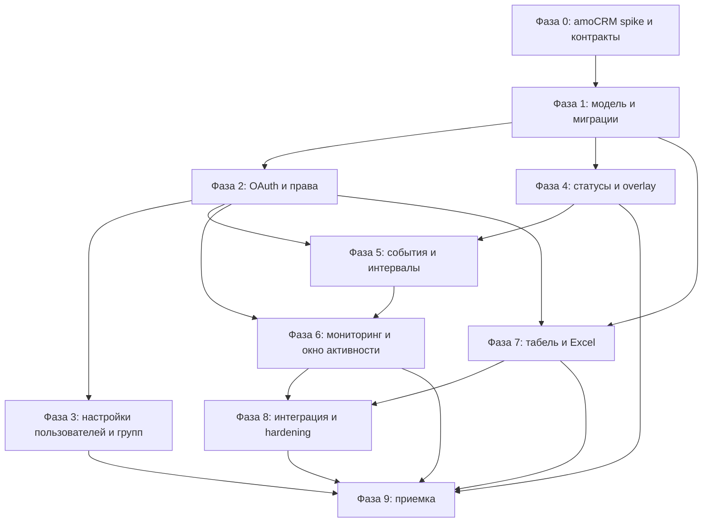

# Виджет «Табель» для amoCRM: план реализации

> **Для разработчиков и агентных исполнителей:** реализовывать план по фазам строго по порядку. После каждой фазы выполнить проверки, обновить этот файл, записать факт и только затем переходить к следующей фазе.

**Цель:** создать production-ready виджет учёта рабочего времени для amoCRM с настройками в интерфейсе подключения/настройки виджета, отдельными группами сотрудников, контролем доступа через права amoCRM, подтверждённой активностью из аналитики amoCRM и отчётами до 3 месяцев.

**Архитектура:** amoCRM Widget отвечает за пользовательский статус, блокирующий overlay и рабочую панель. Backend на FastAPI хранит настройки, группы, сотрудников, рабочие сессии, интервалы активности, события amoCRM и отчёты. Сервер проверяет права пользователя и получает данные amoCRM через OAuth/API/webhooks или согласованный механизм синхронизации. Настройки доступны только в интерфейсе настройки установленного виджета; рабочий экран настроек не показывает.

**Технологии:** Python 3.11+, FastAPI, SQLAlchemy, Alembic, PostgreSQL 15, Pydantic, openpyxl, amoCRM Widget SDK, vanilla JavaScript/HTML/CSS, pytest, Docker Compose.

## Глобальные ограничения и правила

- Доступ к настройкам и возможностям определяется правами пользователя в amoCRM; backend обязан повторно проверять права и не доверять только клиентскому интерфейсу.
- Группы создаются внутри виджета отдельно от отделов amoCRM.
- Группу создаёт администратор; руководитель определяется по роли пользователя в amoCRM и закрепляется за группой настройками администратора.
- Один сотрудник может состоять только в одной группе.
- Администратор видит все включённые группы и сотрудников; руководитель видит только свою группу и себя; сотрудник видит только свой статус и кнопки управления.
- Вкладки настройки виджета: «Настройки» и «Пользователи». Вкладки «Оплата» и «Выданные доступы» не реализуются.
- Во вкладке «Пользователи» загружаются пользователи amoCRM, есть поиск, выбор «Учитывать рабочее время» и выбор «Скрыть виджет».
- «Учитывать рабочее время» включает сотрудника в автоматический табель и отчёты. «Скрыть виджет» убирает рабочий интерфейс и кнопки, но не исключает сотрудника из учёта.
- Рабочие статусы: «Работаю», «Перерыв», «Закончил(а)». После «Закончил(а)» повторный запуск в тот же день возможен только с разрешения администратора.
- В статусе «Работаю» amoCRM доступна. В статусах «Перерыв» и «Закончил(а)» интерфейс затемняется тёмным полупрозрачным overlay и блокируется; остаются только допустимые кнопки.
- Активность учитывается только во время статуса «Работаю».
- Порог отсутствия действий — 5 минут. Действия мышью и клавиатурой сами по себе не считаются рабочим временем и отображаются как интервал «без подтверждённой работы», если не привели к событию amoCRM.
- В подтверждённую активность входят полный доступный перечень событий стандартной аналитики amoCRM и звонки. Обычный клик/ввод без события amoCRM не считается активностью.
- Временная шкала показывает отдельные интервалы работы над задачами/объектами. Длина интервала отражает рассчитанное или фактическое время; источник длительности обязан быть указан.
- Окно сотрудников имеет обычный и полноэкранный режим. Напротив каждого сотрудника есть кнопка открытия активности за 7 дней.
- Активность в интерфейсе отображается зелёными полосками; наведение показывает дату/время, тип, объект, описание, звонок, длительность и ссылку на карточку, если они есть. Пустые участки показывают отсутствие подтверждённой активности.
- Excel содержит табельные поля, но не содержит активность и CRM-события.
- Отчётный период ограничен 3 месяцами на backend, независимо от UI.
- Все даты хранятся в UTC, отображаются в часовом поясе группы. Для каждой группы задаются часовой пояс, начало и конец рабочего дня.
- Ошибки для пользователя формулируются простым русским языком. Технические детали пишутся в структурированные серверные логи с correlation/request ID; секреты и токены в логи не попадают.
- После каждой фазы обновляются разделы «Статус фаз», «Таблица прогресса», «Что сделано», «Что можно проверить», «Блокеры» и журнал изменений этого файла.
- Фоновый ingestion рассчитан минимум на 40 активных аккаунтов: справедливая FIFO-очередь, 1–8 параллельных задач аккаунтов и один короткий последовательный служебный слот без создания 40 одновременных подключений к БД.

## Как работать по плану

1. Перед началом фазы проверить статус предыдущей фазы и зависимости.
2. Для каждой задачи сначала написать тест или проверочный сценарий, который может выявить ошибку.
3. Выполнить реализацию минимально необходимым объёмом, затем запустить узкие проверки и общие проверки фазы.
4. Не закрывать фазу по сообщению агента без проверки diff, тестов и критериев готовности.
5. После фазы обновить этот файл: отметить чекбоксы, заполнить факт, указать созданные/изменённые файлы, результаты проверок и доступный ручной сценарий.
6. Если фаза заблокирована, остановиться, записать причину простыми словами в русский раздел «Блокеры» и не отмечать её выполненной.

## Статус фаз

| Фаза | Название | Статус | Дата | Проверка |
|---:|---|---|---|---|
| 0 | Контракт и технический spike amoCRM | Выполнена с подтверждёнными ограничениями | 2026-09-16 | `pytest -q`: 110 passed; live OAuth/account/users/rights/refresh и 7 типов событий проверены; calls/UI-iframe ограничены |
| 1 | Единая модель данных и миграции | Выполнена | 2026-09-18 | `pytest -q`: 143 passed; 29 точечных unit-тестов прошли при независимом review; PostgreSQL upgrade/downgrade: 4 passed; одна голова `005` |
| 2 | OAuth, синхронизация пользователей и права | Выполнена | 2026-09-19 | `pytest`: 248 passed, 10 skipped; PostgreSQL migrations: 10 passed; независимый entry-gate review: PASS; одна голова `009` |
| 3 | Настройки amoMarket: пользователи и группы | Локально реализована; live gate отложен | 2026-09-22 | Локально: backend `369 passed`, Node `39 passed`, PostgreSQL migrations `15 passed`, package tests `12 passed`, `010 (head)`, ZIP `16` файлов; complete live amoCRM smoke и детальная приёмка отложены до локальной реализации всех фаз |
| 4 | Рабочие статусы и блокирующий интерфейс | Локально выполнена; live gate отложен | 2026-09-23 | Backend `404 passed`, Node `42 + 15 passed`, browser `11 passed`, package `12 passed`; независимый review закрыт; `widget.zip` содержит 18 точных runtime-файлов |
| 5 | Источник событий amoCRM и активность | Локально выполнена; live gate отложен | 2026-09-28 | PostgreSQL backend `620 passed`; Node `8 + 15 + 42 passed`; Playwright `13 passed`; package `12 passed`; `013 (head)`; общий review — APPROVED; ZIP — 19 файлов |
| 6 | API мониторинга и окно активности | Локально выполнена; live gate отложен | 2026-09-29 | PostgreSQL backend `630 passed`; Node `91 passed`; Playwright `17 passed`; package `12 passed`; `013 (head)`; ZIP `23` файла; общий review — APPROVED |
| 7 | Табель, отчёты и Excel | Локально выполнена; live gate отложен | 2026-09-30 | PostgreSQL backend `692 passed`; Node `112 passed`; Playwright `24 passed`; package `14 passed`; `013 (head)`; ZIP `25` файлов; общий review — APPROVED |
| 8 | Интеграция, безопасность и производительность | Локально выполнена; GitHub CI подтверждён, target Docker/live gates открыты | 2026-10-04 | PostgreSQL backend `738 passed`; Node `112`; Playwright `25`; package `14`; migration regression `32`; `014 (head)`; GitHub CI PASS на `8b99846`; общий review — APPROVED |
| 9 | Приёмка и документация | Локально выполнена; GitHub CI подтверждён, остальные release gates открыты | 2026-10-04 | PostgreSQL backend `743 passed`; Node `112`; Playwright `27`; package `14`; `014 (head)`; ZIP `25` файлов; GitHub push/PR CI PASS на `8b99846`; live catalog/calls/latency и target Docker остаются открыты |

## Таблица прогресса

| План | Факт | Статус | Блокеры |
|---|---|---|---|
| Проверить доступность API событий аналитики amoCRM и звонков | Live OAuth/refresh подтверждены; создан controlled `[TEST CODEX]` набор; наблюдались 7 типов/11 событий и реальные field shapes; `/api/v4/calls` вернул 405 | Выполнено с ограничениями | Полный каталог, реальные звонки, общая latency/pagination и iframe-поведение не подтверждены; используется явный `unavailable` fallback |
| Выровнять существующие модели, сервисы и API | Модели, схемы и подключённые маршруты используют verified request context, account scope и policy-фильтрацию | Выполнено | Нет |
| Ввести отдельные группы виджета и уникальность группы сотрудника | Добавлены `WidgetGroup`/`GroupMember`; PostgreSQL запрещает второе активное членство в пределах аккаунта и сохраняет историю неактивных членств | Выполнено | Нет; чистый и заполненный цикл миграций проверен на PostgreSQL |
| Реализовать настройки «Учитывать» и «Скрыть» | `frontend/settings/*`, `widget/script.js`, `backend/app/api/v1/settings.py`, `settings_snapshot_service.py`; локальный DOM smoke и API-тесты прошли | Локально выполнено, live gate открыт | Проверить реальный `onSave`/`$authorizedAjax` в amoCRM и схему persistent БД со старой `010` |
| Реализовать статусы и overlay | Доменный автомат, idempotent-команды, authenticated API, fail-open controller и блокирующий overlay реализованы; `widget.zip` пересобран | Локально выполнено, live gate отложен | Реальный порядок событий/стилей и CORS в amoCRM проверяются после локальной реализации всех фаз |
| Получать полный перечень событий аналитики и звонки | Реализованы хранилище, fail-closed нормализатор, polling, безопасный webhook и worker с FIFO на 40 аккаунтов; 402/403 останавливают подключение, неизвестные типы сохраняются | Локально выполнено | Читаемый источник звонков не подтверждён; такие звонки не становятся подтверждённой активностью |
| Реализовать интервалы с порогом 5 минут | Серверные интервалы, пакетное закрытие после 5 минут, API присутствия, worker и приватный минутный browser-буфер прошли сквозной PostgreSQL gate | Выполнено | Live amoCRM smoke отложен до локальной реализации всех фаз |
| Реализовать мониторинг по ролям и активность за 7 дней | API, dashboard, timeline/modal, polling/backoff и интеграция виджета прошли общий gate; 40 аккаунтов изолированы | Локально выполнено | Live amoCRM UI/CORS и реальные стили проверяются после локальной реализации всех фаз |
| Реализовать табель до 3 месяцев и Excel без активности | Backend, UI и widget lifecycle готовы; безопасный XLSX без activity, роли, 40 аккаунтов и точный ZIP 25 файлов прошли общий gate | Локально выполнено | Live amoCRM UI, CORS и blob-download проверяются после локальной реализации всех фаз |
| Провести integration/security/performance hardening | Production runtime, observability, tenant-aware ingress, индексы, безопасный cache, recovery и CI workflow проверены; GitHub CI на `8b99846` прошёл; 40 аккаунтов изолированы | Локально выполнено; CI подтверждён | Нужны target Docker build/up/readiness и controlled live amoCRM gate |
| Провести end-to-end приёмку | Роли, рабочий цикл, 7-дневная активность, отчёты, Excel, ошибки, recovery и 40 аккаунтов прошли локальный общий gate; GitHub CI подтверждён; документация и release checklist готовы | Локально выполнено; CI подтверждён | Controlled live amoCRM, полный каталог/звонки/latency, Docker target и preflight/backup реальной stamped-010 БД |

## Фаза 0. Контракт и технический spike amoCRM

**Готовое состояние:** зафиксированы проверенные возможности amoCRM, единый API-контракт и список ограничений. Разработка не зависит от догадок о том, можно ли получить события аналитики, звонки, пользователя и его права.

**Задачи:**

- [x] Составить таблицу требований из этого плана и текущего кода в `docs/requirements-matrix.md`.
- [x] Проверить manifest и доступные locations/scopes для установленного виджета в `widget/manifest.json`.
- [x] Проверить, как amoCRM передаёт OAuth authorization code, refresh token, account ID, user ID и роли; неподтверждённое role mapping явно вынесено в фазу 2.
- [x] Проверить API/аналитику событий: наблюдаемые типы, автора, timestamp, сущность, ссылки и pagination metadata; полный каталог и общие гарантии помечены недоступными до появления соответствующих действий.
- [x] Проверить API звонков: reader endpoint вернул 405; направление, длительность, автор и карточка помечены `unavailable`, а не выдуманы.
- [x] Проверить границу мыши/клавиатуры: browser input не считается подтверждённой активностью без CRM-события; реальная iframe-граница оставлена как ограничение widget UI.
- [x] Описать fallback, если API amoCRM не отдаёт отдельное поле или событие, в `docs/amocrm-integration-limits.md`.
- [x] Зафиксировать JSON-контракты: `GET /me`, `GET /settings`, status transitions, team, timeline, report, export.

**Файлы:**

- Create: `docs/requirements-matrix.md`
- Create: `docs/amocrm-integration-limits.md`
- Create: `docs/api-contract.md`
- Modify: `widget/manifest.json`
- Test: `backend/tests/integration/test_amocrm_contract.py`

**Проверки:** контрактные тесты с mock-ответами amoCRM; ручной spike в тестовом аккаунте; отрицательная проверка отсутствующего/просроченного токена.

**Критерии готовности:** нет неизвестных полей, от которых зависит следующая фаза; явно отмечено, какие события реально доступны; при невозможности получить событие есть согласованный статус «данные недоступны», а не выдуманное событие.

## Фаза 1. Единая модель данных и миграции

**Готовое состояние:** backend запускается на одной согласованной модели без рассинхрона `id/status/account_id`; миграции воспроизводятся с пустой базы; доменные правила имеют unit-тесты.

**Задачи:**

- [x] Зафиксировать идентификаторы: внутренний `User.id`, `amocrm_user_id`, `amocrm_account_id`; убрать доверие к клиентскому внутреннему ID.
- [x] Создать/обновить модели `User`, `WidgetSettings`, `WidgetGroup`, `GroupMember`, `WorkSession`, `StatusTransition`, `ActivityInterval`, `CrmEvent`, `CallEvent`, `WorkComment`.
- [x] Добавить группе `timezone`, `work_start_time`, `work_end_time`, `is_active`.
- [x] Добавить уникальное ограничение одного активного членства сотрудника в одной группе.
- [x] Разделить `active_duration`, `unconfirmed_duration`, `break_duration` и `idle_duration`.
- [x] Добавить источник интервала: `crm_event`, `call`, `unconfirmed_input`; незарегистрированные клики не записывать как CRM activity.
- [x] Создать последовательную миграцию после текущей цепочки и проверить upgrade/downgrade на копии БД.
- [x] Выровнять сервисы и схемы с фактическими полями; удалить или переписать обращения к отсутствующим `WorkSession.account_id`, `status`, `session_id`, `WorkComment.session_id`.

**Файлы:**

- Create/modify: `backend/app/models/*.py`
- Create: `backend/app/models/widget_group.py`, `group_member.py`, `activity_interval.py`, `crm_event.py`, `call_event.py`
- Modify: `backend/app/schemas/*.py`, `backend/app/services/*.py`
- Create: `backend/migrations/versions/<next>_timesheet_v2.py`
- Test: `backend/tests/unit/test_models.py`, `test_interval_rules.py`, `backend/tests/integration/test_migrations.py`

**Критерии готовности:** новая база поднимается миграциями; повторное добавление сотрудника во вторую группу отклоняется; нельзя создать activity interval вне `Работаю`; тесты модели проходят.

## Фаза 2. OAuth, синхронизация пользователей и права

**Готовое состояние:** backend знает пользователя и аккаунт через проверенный amoCRM OAuth, синхронизирует пользователей, а каждый API-ответ фильтруется по правам amoCRM и группе виджета.

**Задачи:**

- [x] Создать `backend/app/integrations/amocrm_client.py` с timeout, retry для временных ошибок, rate-limit обработкой и безопасным логированием.
- [x] Создать `backend/app/integrations/oauth.py` для authorization code, refresh token и шифрования/маскировки токенов.
- [x] Создать `backend/app/services/user_sync_service.py` для users, ролей, имени, email, avatar и account metadata.
- [x] Создать `backend/app/core/access_policy.py`: employee/manager/admin, проверка видимости группы и сотрудника.
- [x] Заменить доверенные заголовки `X-User-Id`/`X-Account-Id` на проверенный контекст запроса; оставить заголовки только как тестовый adapter.
- [x] Синхронизировать изменения состава пользователей без удаления истории табеля.
- [x] Добавить 401/403/404/409/429 тесты и проверку прямого запроса РОП к чужой группе.

**Файлы:**

- Create: `backend/app/integrations/amocrm_client.py`, `oauth.py`
- Create: `backend/app/services/user_sync_service.py`, `access_service.py`
- Create/modify: `backend/app/core/access_policy.py`, `backend/app/core/security.py`
- Modify: `backend/app/api/v1/dependencies.py`, all protected endpoints
- Test: `backend/tests/integration/test_oauth.py`, `test_access_policy.py`, `test_user_sync.py`

**Критерии готовности:** сотрудник получает только свой контекст; руководитель только свою группу; администратор все включённые группы; подмена ID в запросе не расширяет доступ.

## Фаза 3. Настройки amoMarket: пользователи и группы

**Готовое состояние:** при открытии установленного виджета в настройках доступны только вкладки «Настройки» и «Пользователи». Администратор включает учёт, скрывает рабочий UI, создаёт группы и задаёт расписание.

**Задачи:**

- [x] Переписать `widget/manifest.json` под фактически поддерживаемые поля settings/advanced settings и права amoCRM.
- [x] Разделить callbacks `settings`, `advancedSettings`, `onSave` и рабочий `init`; рабочий `init` не рендерит редактор настроек.
- [x] Создать `frontend/settings/settings.html`, `settings.js`, `settings.css` или адаптировать существующую admin-панель без вкладок оплаты и выданных доступов.
- [x] Реализовать вкладку «Пользователи»: список amoCRM, поиск, amoCRM-группировка, `Учитывать рабочее время`, `Скрыть виджет`, группа сотрудника и сохранение.
- [x] Реализовать вкладку «Настройки»: телефон поддержки, статусы, редактор групп, руководитель, часовой пояс, начало/конец дня, разрешение повторного запуска.
- [x] Запретить сохранение включённого сотрудника без группы; не позволять назначить сотрудника в две группы.
- [x] Обеспечить идемпотентное сохранение и восстановление данных после перезагрузки.

**Файлы:**

- Modify: `widget/manifest.json`, `widget/script.js`, `widget/styles.css`
- Create/modify: `frontend/settings/settings.html`, `frontend/settings/settings.js`, `frontend/settings/settings.css`
- Create/modify: `backend/app/api/v1/settings.py`, `backend/app/api/v1/users.py`, `backend/app/api/v1/groups.py`
- Test: `backend/tests/api/test_settings.py`, `test_groups.py`; browser smoke tests `frontend/tests/settings.spec.js`

**Критерии готовности:** настройки сохраняются только у пользователя с нужным правом amoCRM; «Скрыть» не выключает учёт; один сотрудник имеет максимум одну группу; настройки отсутствуют в рабочем интерфейсе.

## Фаза 4. Рабочие статусы и блокирующий интерфейс

**Baseline 2026-09-22:** общий backend-прогон дал `350 passed`, `18 skipped`, `1 failed` в `test_legacy_consumers_query_canonical_fields_and_correct_account`: старая KPI-логика определяет «сегодня» по локальной дате компьютера, а сессия хранит время в UTC. При переходе местной даты раньше UTC-даты тест получает ноль вместо часа. Это открытая задача фазы, а не пройденная проверка.

**Итог 2026-09-23:** KPI и рабочие статусы используют business date группы; полный PostgreSQL-прогон завершён результатом `404 passed`, `0 skipped`. Независимый review и дополнительные проверки fail-open закрыты.

**Готовое состояние:** сотрудник может менять только собственный статус, backend корректно считает рабочий день/перерывы/опоздание, а overlay блокирует amoCRM в нерабочих состояниях.

**Задачи:**

- [x] Создать доменный автомат переходов: `BEFORE_WORKDAY -> WORKING -> BREAK -> WORKING -> FINISHED`; повтор `FINISHED -> WORKING` только по разрешению администратора.
- [x] Реализовать idempotency key для кнопок, защиту двойного клика и конфликтов вкладок.
- [x] Рассчитывать начало/конец дня, опоздание и длительность по часовому поясу группы, хранить timestamps в UTC.
- [x] Вынести overlay из дублирующего inline CSS и применить namespace классов виджета.
- [x] Реализовать состояния `Работаю`, `Перерыв`, `Закончил(а)`, включая затемнение и только допустимые кнопки.
- [x] Для скрытого пользователя не показывать UI, но продолжать серверный учёт.
- [x] Убрать demo fallback: при недоступном backend полностью убирать кнопки и затемнение, оставляя amoCRM доступной без ложного статуса.

**Файлы:**

- Create/modify: `backend/app/services/timesheet_service.py`, `backend/app/api/v1/sessions.py`
- Modify: `backend/app/models/work_session.py`, `status_transition.py`
- Create/modify: `widget/script.js`, `widget/styles.css`, `widget/overlay.js`
- Test: `backend/tests/unit/test_timesheet_transitions.py`, `test_timezone_schedule.py`, `backend/tests/api/test_sessions.py`
- Browser tests: `frontend/tests/overlay.spec.js`

**Критерии готовности:** все переходы и запреты покрыты тестами; overlay нельзя обойти кликом; сбой backend не переводит пользователя в ложный `Работаю`; повторный запуск требует админского разрешения.

## Фаза 5. Источник событий amoCRM и активность

**Готовое состояние:** backend получает доступные аналитические события и звонки, связывает их с пользователем и рабочей сессией, строит интервалы с порогом 5 минут и различает подтверждённую работу и действия без результата.

**Задачи:**

- [x] Реализовать ingestion webhook/polling согласно результатам фазы 0; хранить raw payload для диагностики с ограниченным сроком хранения.
- [x] Создать нормализатор полного справочника событий amoCRM с неизвестным типом `unknown`, не теряя исходный payload.
- [x] Создать нормализатор звонков: направление, длительность, автор, связанная карточка.
- [x] Ввести deduplication по account/event ID/source/timestamp.
- [x] Реализовать клиентский буфер действий только для определения интервала присутствия; не записывать каждый клик/символ.
- [x] Закрывать интервал после 5 минут отсутствия действий; действия без события amoCRM помечать `unconfirmed_input` и не включать в подтверждённое рабочее время.
- [x] Связывать CRM-событие с ближайшим интервалом `Работаю`; события в `BREAK`/`FINISHED` не включать в activity.
- [x] Для звонка использовать фактическую длительность; для остальных событий хранить `duration_source=calculated` только когда расчёт обоснован, иначе показывать точку/минимальный интервал без выдуманной длительности.

**Файлы:**

- Create: `backend/app/services/event_ingestion_service.py`, `event_normalizer.py`, `activity_interval_service.py`
- Create/modify: `backend/app/api/v1/activity.py`, `backend/app/api/v1/webhooks.py`
- Create: `frontend/widget/activity-tracker.js`
- Modify: `backend/app/models/activity_event.py`, `activity_session.py`
- Test: `backend/tests/unit/test_event_normalizer.py`, `test_activity_intervals.py`, `backend/tests/integration/test_activity_ingestion.py`
- Browser tests: `frontend/tests/activity-tracker.spec.js`

**Критерии готовности:** событие amoCRM попадает в правильного сотрудника; дубликат не создаёт вторую запись; отсутствие результата не становится зелёной активностью; период свыше 5 минут закрывает интервал; перерывы не учитываются.

## Фаза 6. API мониторинга и окно активности

**Готовое состояние:** администратор видит все разрешённые группы, руководитель свою группу и себя; напротив сотрудника есть кнопка активности за 7 дней; окно разворачивается на весь экран.

**Задачи:**

- [x] Реализовать `GET /team/status` с фильтрами поиска/статуса и серверным access policy.
- [x] Реализовать `GET /team/{user_id}/activity?from=&to=` с жёстким максимумом 7 календарных дней для окна.
- [x] Возвращать группы, сотрудников, статус, начало/конец дня, агрегаты активности и временные интервалы.
- [x] Разрешить activity detail только admin/руководителю доступной группы; сотрудник не видит чужую активность.
- [x] Создать мониторинг по образцу правой части примера: группы, сотрудник, агрегаты, шкала дня, зелёные полоски и статус.
- [x] Реализовать tooltip при наведении и zoom с видимыми пустыми промежутками.
- [x] Добавить кнопку «гамбургер» напротив каждого сотрудника, modal активности за 7 дней, закрытие Escape и fullscreen toggle.
- [x] Добавить polling с backoff и ручное обновление; не сбрасывать выбранный сотрудник при обновлении.

**Файлы:**

- Modify: `backend/app/api/v1/team.py`, `backend/app/services/team_service.py`
- Create/modify: `frontend/monitoring/dashboard.html`, `dashboard.js`, `styles.css`
- Create: `frontend/monitoring/activity-modal.js`, `timeline.js`
- Test: `backend/tests/api/test_team_visibility.py`, `test_activity_window.py`
- Browser tests: `frontend/tests/monitoring.spec.js`

**Критерии готовности:** проверка API и UI подтверждает три уровня видимости; шкала содержит интервалы, пустоты и tooltip; fullscreen работает; окно ограничено 7 днями и не показывает activity в Excel.

## Фаза 7. Табель, отчёты и Excel

**Готовое состояние:** таблица табеля показывает выбранных для учёта сотрудников, период от одного дня до трёх месяцев, нужные поля и скачивание Excel без activity.

**Задачи:**

- [x] Реализовать `GET /reports/detailed` с фильтрами employee/group/date и pagination 10 строк.
- [x] Проверять `date_to - date_from <= 3 months` на backend; возвращать русскую ошибку с допустимым диапазоном.
- [x] Вернуть колонки: сотрудник, дата, начало рабочего дня, конец рабочего дня, общее время перерывов, общее время работы, опоздание, статус.
- [x] Исключить из табеля и Excel зелёные полосы, события, звонки и ссылки на карточки.
- [x] Реализовать Excel с выбранными табельными колонками, часовым поясом группы и безопасными именами файлов.
- [x] Добавить preview таблицы и кнопку скачивания с состояниями loading/error/success.
- [x] Добавить проверку, что сотрудник/группа в фильтре доступен текущему пользователю.

**Файлы:**

- Modify: `backend/app/api/v1/reports.py`, `report_service.py`, `excel_service.py`
- Create/modify: `backend/app/api/v1/excel.py`, `backend/app/schemas/report.py`, `excel.py`
- Modify: `frontend/reports.html`, `frontend/assets/js/reports.js`, `frontend/assets/css/reports.css`
- Test: `backend/tests/api/test_reports.py`, `test_excel_export.py`, `backend/tests/unit/test_report_period.py`
- Browser tests: `frontend/tests/reports.spec.js`

**Критерии готовности:** отчёт за 1 день, 7 дней, 1 месяц и 3 месяца работает; период больше 3 месяцев отклоняется; Excel открывается и содержит только табельные поля; РОП не может выгрузить чужую группу.

## Фаза 8. Интеграция, безопасность и производительность

**Готовое состояние:** все части работают вместе в Docker/test environment, проверены безопасность, повторная доставка событий, задержки и поведение при недоступности amoCRM/backend.

**Задачи:**

- [x] Привести `docker-compose.yml`, `Dockerfile`, `.env.example`, health checks и migrations к воспроизводимому запуску.
- [x] Добавить correlation ID, JSON logs, redaction токенов и единый словарь пользовательских ошибок.
- [x] Добавить rate limit, webhook signature validation, replay protection и ограничение размера payload.
- [x] Проверить SQL indexes по account/user/group/timestamp и N+1 запросы в командном мониторинге.
- [x] Добавить кэш только для безопасных справочников; не кэшировать права без TTL/invalidation.
- [x] Проверить polling/backoff, дедупликацию и восстановление после временного падения amoCRM.
- [x] Запустить smoke, integration, browser и security tests в CI.

**Файлы:**

- Modify: `docker-compose.yml`, `backend/Dockerfile`, `backend/.env.example`, `backend/app/core/config.py`
- Create/modify: `backend/app/core/logging.py`, `error_catalog.py`, `middleware.py`
- Create: `.github/workflows/ci.yml`, `docs/operations.md`
- Test: `backend/tests/integration/test_failure_recovery.py`, `test_security.py`, `frontend/tests/smoke.spec.js`

**Критерии готовности:** чистый запуск с нуля; ошибки внешнего API не теряют данные и показываются понятным сообщением; секреты не попадают в логи; CI проходит; контрольные API укладываются в согласованный SLA или имеют документированное объяснение.

## Фаза 9. Приёмка и документация

**Готовое состояние:** продукт проверен по пользовательским сценариям, документация совпадает с кодом, этот план содержит факт выполнения всех фаз и список остаточных рисков.

**Задачи:**

- [x] Провести сценарий сотрудника: скрыт/видим, начать, перерыв, продолжить, закончить, повторный запуск с разрешением.
- [x] Провести сценарий руководителя: только своя группа, своя активность недоступна как детальный отчёт, чужая группа запрещена.
- [x] Провести сценарий администратора: пользователи, группы, расписания, права, мониторинг, отчёт и Excel.
- [x] Проверить активность за 7 дней, tooltip, zoom, пустые интервалы и fullscreen.
- [ ] Проверить полный перечень событий, звонки, дубликаты, задержку доставки и неизвестный тип события.
- [x] Проверить русские сообщения ошибок и технические логи по каждому отказу.
- [x] Обновить `README.md`, `docs/API.md`, `docs/CONFIGURATION.md`, `docs/DEPLOYMENT.md` и таблицу прогресса в этом файле.
- [x] Составить release checklist и список известных ограничений amoCRM.

**Файлы:**

- Modify: `README.md`, `docs/API.md`, `docs/CONFIGURATION.md`, `docs/DEPLOYMENT.md`, `Plan.md`
- Create: `docs/acceptance-report.md`, `docs/release-checklist.md`
- Test: `backend/tests/e2e/test_user_scenarios.py`, `frontend/tests/e2e.spec.js`

**Критерии готовности:** все обязательные сценарии пройдены; нет незакрытых критических ошибок; документация объясняет установку, настройку, права, импорт событий, отчёты и восстановление после ошибок.

## Зависимости между задачами

```mermaid
flowchart TD
    P0[Фаза 0: amoCRM spike и контракты] --> P1[Фаза 1: модель и миграции]
    P1 --> P2[Фаза 2: OAuth и права]
    P2 --> P3[Фаза 3: настройки пользователей и групп]
    P1 --> P4[Фаза 4: статусы и overlay]
    P2 --> P5[Фаза 5: события и интервалы]
    P4 --> P5
    P2 --> P6[Фаза 6: мониторинг и окно активности]
    P5 --> P6
    P1 --> P7[Фаза 7: табель и Excel]
    P2 --> P7
    P6 --> P8[Фаза 8: интеграция и hardening]
    P7 --> P8
    P3 --> P9[Фаза 9: приемка]
    P4 --> P9
    P6 --> P9
    P7 --> P9
    P8 --> P9
```

## Обработка ошибок

### Правило для пользователя

Каждая ошибка должна иметь короткое русское сообщение, действие для восстановления и код для поддержки. Примеры:

| Ситуация | Сообщение пользователю | Действие |
|---|---|---|
| amoCRM недоступна | «Не удалось получить данные amoCRM. Повторите попытку через минуту.» | Повторить, сохранить локальный буфер |
| Сессия истекла | «Срок подключения amoCRM истёк. Обратитесь к администратору.» | Не менять статус, предложить переподключение |
| Нет права | «У вас нет доступа к этому разделу.» | Скрыть действие и записать 403 |
| Нет группы | «Для учёта сотруднику нужно назначить группу.» | Открыть настройки для администратора |
| Вторая группа | «Сотрудник уже состоит в другой группе.» | Показать текущую группу |
| Слишком длинный отчёт | «Период отчёта не может быть больше 3 месяцев.» | Исправить даты |
| Сохранение не удалось | «Изменения не сохранены. Проверьте соединение и повторите.» | Не сбрасывать введённые значения |
| Событие неполное | «Событие получено, но часть данных пока недоступна.» | Показать событие с признаком неполноты |
| Backend недоступен | «Временная ошибка сервиса. Статус будет проверен после восстановления соединения.» | Не включать ложный `Работаю`, повторить polling |

### Правило для разработчика

- Каждая ошибка получает стабильный код вида `AMO_AUTH_EXPIRED`, `ACCESS_DENIED`, `GROUP_DUPLICATE`, `REPORT_RANGE_LIMIT`, `EVENT_PAYLOAD_INVALID`.
- Лог содержит `timestamp`, `level`, `service`, `request_id`, `account_id` в безопасном виде, `user_id`, `error_code`, HTTP status и краткую причину.
- Access token, refresh token, cookie, полный webhook payload с персональными данными и пароль никогда не логируются.
- Временные ошибки amoCRM повторяются с ограниченным backoff; ошибки прав, валидации и конфликтов не повторяются автоматически.
- Необработанная ошибка не должна менять статус сотрудника, удалять историю или считать неподтверждённую активность рабочим временем.
- Ошибки ingestion отправляются в retry queue/dead-letter storage и доступны администратору по техническому журналу, но не показывают пользователю внутренний stack trace.

## Автообновление плана после каждой фазы

После завершения фазы агент или разработчик обязан выполнить следующие действия:

1. Обновить `[ ]` на `[x]` у выполненных задач фазы.
2. В таблице «Статус фаз» заменить статус на `Выполнена`, указать дату и команду проверки.
3. В таблице «Таблица прогресса» заполнить колонку «Факт» конкретными файлами и командами.
4. Добавить раздел `### Отчёт по фазе N` с четырьмя подразделами: «Что сделано», «Созданные и изменённые файлы», «Что можно проверить», «Блокеры и остаточные риски».
5. Выполнить `git diff --check`, узкие тесты фазы и общий доступный test/build command; записать фактический результат.
6. Если есть незакрытая ошибка, оставить фазу `В работе` или `Заблокирована`; не отмечать выполненной только потому, что код написан.
7. В начале следующей фазы проверить, что её зависимости имеют статус `Выполнена`.

### Отчёт по фазе 0

#### Что сделано

- Проведена инвентаризация amoMarket-оболочки: рабочим исходником является `widget/`; архивы в корне считаются сборочными артефактами.
- Зафиксирована матрица требований, черновой API-контракт и список ограничений amoCRM.
- Отделены подтверждённые локальным кодом факты от того, что можно проверить только в тестовом аккаунте.
- Записано безопасное поведение: локальные клики и клавиатура не становятся зелёной активностью без CRM-события.
- Добавлен контрактный adapter OAuth и нормализации событий с проверкой доверенного tenant URL и безопасным fallback неполных событий.
- Выполнен OAuth authorization-code exchange и безопасная refresh rotation; токены хранятся только в игнорируемом `.env`.
- Подтверждены live account/users/rights shapes и metadata пагинации одной страницы.
- По разрешению пользователя создан набор `[TEST CODEX]`; наблюдались 11 событий семи типов и подтверждены реальные string event IDs, timestamps, authors, entity fields и API entity links.
- Нормализатор выровнен с live-shape; системные события с `created_by <= 0` остаются `incomplete_event` без подмены автора.
- Добавлено 110 контрактных тестов; независимые ревью и пять раундов исправлений закрыли все Critical/Important замечания.

#### Созданные и изменённые файлы

- Создан `docs/requirements-matrix.md`.
- Создан `docs/amocrm-integration-limits.md`.
- Создан `docs/api-contract.md`.
- Созданы `backend/app/integrations/__init__.py`, `backend/app/integrations/amocrm_contract.py`.
- Создан `backend/tests/integration/test_amocrm_contract.py`.
- Создан `backend/tests/integration/fixtures/amocrm_observed_event.json`.
- Обновлён `Plan.md`.

#### Что можно проверить

- Открыть три документа в `docs/` и проверить соответствие обсуждённым требованиям.
- Сверить `widget/manifest.json` и ограничения locations/scopes в документации.
- В тестовом amoCRM найти созданные contact/company/lead/task/note по префиксу `[TEST CODEX]`; существующие записи не изменялись и ничего не удалялось.
- Локально выполнить `D:\табель\.venv312\Scripts\python.exe -m pytest -q` из `backend/` — ожидается `110 passed`.
- Открыть `docs/amocrm-integration-limits.md` и проверить разделение confirmed live facts, observed-only facts и unavailable capabilities.

#### Блокеры и остаточные риски

- Блокеров для начала фазы 1 нет.
- Семь наблюдённых типов не считаются полным каталогом amoCRM; неизвестные типы сохраняются безопасно как неполные.
- `GET /api/v4/calls` недоступен как reader endpoint; реальные call fields будут подтверждаться только при наличии согласованного источника звонков.
- Общие гарантии multi-page pagination, delivery latency/dedup, role mapping и реальная iframe-граница не доказаны одним тестовым сценарием и остаются явными рисками следующих фаз.

### Отчёт по фазе 1

#### Что сделано

- Разделены внутренний ID пользователя и внешние ID amoCRM; все внешние ссылки ограничены аккаунтом.
- Согласованы 10 доменных моделей, схемы и использующие их сервисы/API.
- Для группы зафиксированы часовой пояс, начало/конец рабочего дня, руководитель и признак активности.
- В PostgreSQL действует правило одного активного членства сотрудника; история неактивных членств сохраняется.
- Время разделено на подтверждённую, неподтверждённую, перерыв и простой; источники интервалов различаются явно.
- Подтверждённая активность создаётся только во время статуса `Работаю`; системное событие без пользователя не выдаётся за активность сотрудника.
- Добавлена последовательная миграция `005`; чистая и заполненная база прошли `upgrade → downgrade → upgrade` на PostgreSQL.
- Независимый review завершён без критических и важных замечаний.

#### Созданные и изменённые файлы

- Созданы: `backend/app/core/time_utils.py`, `backend/migrations/versions/005_unified_domain.py`, `backend/tests/conftest.py`, `backend/tests/unit/test_models.py`, `backend/tests/unit/test_interval_rules.py`, `backend/tests/integration/test_migrations.py`, `docs/domain-model.md`.
- Изменены модели: `activity_event.py`, `activity_interval.py`, `activity_session.py`, `call_event.py`, `crm_event.py`, `group_member.py`, `status_transition.py`, `user.py`, `widget_group.py`, `widget_settings.py`, `work_session.py`.
- Изменены потребители модели: `backend/app/schemas/work_session.py`, `backend/app/api/v1/sessions.py`, `backend/app/api/v1/endpoints/kpi.py`, `backend/app/services/session_service.py`, `team_service.py`, `report_service.py`, `kpi_service.py`, `excel_service.py`.
- В `001_initial_timesheet_tables.py` удалено только дублирующее создание того же индекса, которое мешало развернуть пустую PostgreSQL-базу; явный индекс сохранён.

#### Что можно проверить

- Из `backend/` выполнить `..\.venv312\Scripts\python.exe -m pytest -q` — ожидается `143 passed`.
- Выполнить `..\.venv312\Scripts\python.exe -m alembic heads` — должна быть одна голова `005`.
- Открыть `docs/domain-model.md`: там описаны идентификаторы, группы, длительности и допустимые источники активности.
- В unit-тестах можно проверить, что второе активное членство и подтверждённый интервал вне `Работаю` отклоняются.

#### Блокеры и остаточные риски

- Блокеров для начала фазы 2 нет.
- Остались 24 предупреждения в старых схемах/зависимостях; они не вызваны фазой 1 и не мешают тестам.
- Полная проверка прав и доверенного контекста запроса намеренно остаётся фазой 2.
- Миграция останавливается, если старые данные нельзя однозначно связать с аккаунтом: это защищает данные от молчаливой порчи, но перед production-развёртыванием потребуется проверка реальной базы.

### Отчёт по фазе 2

#### Что сделано

- Добавлены безопасный amoCRM-клиент, OAuth code/refresh flow, шифрованное хранение токенов и маскирование диагностики.
- Добавлены синхронизация пользователей/аккаунта без удаления истории и verified `RequestContext` без доверия к production `X-User-Id`/`X-Account-Id`.
- Реализованы account-scoped правила employee/manager/admin; руководитель ограничен активной группой и актуальным снимком роли amoCRM, администратор — текущим `is_admin`.
- Все подключённые защищённые маршруты проверяют account/user/session/group/department/category scope; списки, отчёты, KPI и Excel фильтруются по видимым сотрудникам.
- Изменение рабочей и CRM-активности разрешено только владельцу сессии; видимость руководителя/администратора не даёт право менять чужую активность.
- Добавлены миграции `006`–`009`: OAuth connections, владельцы категорий/отделов и снимок роли руководителя. Опасные откаты останавливаются вместо потери security-данных.
- Независимый review входной security-границы завершён с `PASS`.

#### Созданные и изменённые файлы

- Созданы: `backend/app/integrations/amocrm_client.py`, `oauth.py`, `backend/app/core/access_policy.py`, `backend/app/api/v1/dependencies.py`, `backend/app/models/oauth_connection.py`, `backend/app/services/user_sync_service.py`.
- Созданы миграции: `006_oauth_connections_and_user_sync.py`, `007_account_scope_activity_categories.py`, `008_manager_role_and_category_scope.py`, `009_department_account_scope.py`.
- Созданы тесты: `test_oauth.py`, `test_access_policy.py`, `test_request_context.py`, `test_user_sync.py`, `test_authorized_routes.py`; расширены migration/model tests.
- Обновлены подключённые API и сервисы: activity, categories, departments, Excel, KPI, reports, sessions, settings, team и соответствующие модели/схемы.

#### Что можно проверить

- Из `backend/` выполнить `..\.venv312\Scripts\python.exe -m pytest -q` — последний полный результат без внешней PostgreSQL: `248 passed, 10 skipped`.
- При отдельной PostgreSQL выполнить migration suite с `TEST_POSTGRES_ADMIN_URL` — подтверждено `10 passed`; `alembic heads` показывает `009 (head)`.
- Проверить тесты `test_request_context.py` и `test_authorized_routes.py`: forged `X-*`, чужие аккаунты/группы/сессии и изменение чужой активности отклоняются.

#### Блокеры и остаточные риски

- Блокеров для начала фазы 3 нет.
- Live redirect после текущей реализации повторно не выполнялся; code/refresh и права покрыты контрактными/HTTP-тестами, а phase-0 live OAuth evidence сохранён.
- Неоднозначные старые category/department данные намеренно остаются без владельца и fail closed, пока администратор не выполнит безопасное назначение.
- В тестах остаются legacy/dependency warnings; они видимы и не скрыты фильтрами.

### Отчёт по фазе 3 (локальная готовность, не приёмка live amoCRM)

#### Что сделано

- Реализованы account-scoped snapshot API, редактор двух вкладок, независимые `track_time`/`hide_widget`, группы, валидация и канонический ответ после сохранения.
- `settings`, `advancedSettings`, `onSave` и рабочий `init` разделены; manifest содержит только `settings`/`advanced_settings`. `frontend/admin.html` остаётся прототипом.
- Сборка не меняет исходники, включает ровно 16 runtime-файлов с `settings/*` и проверяется отдельным валидатором. API URL подставляется только в staged i18n-строку; native `api_url` нужно ввести вручную, это не browser OAuth token.
- Локальный DOM smoke проверяет создание группы, назначение пользователя, авторизованный `PUT`, принятие канонического snapshot и отсутствие редактора в рабочей области.

#### Созданные и изменённые файлы

- Backend фазы: `backend/migrations/versions/010_widget_settings_snapshot.py`, модели/схемы/сервис snapshot, `backend/app/api/v1/settings.py`, auth/CORS и API/migration тесты.
- Frontend фазы: `widget/manifest.json`, `widget/script.js`, `frontend/settings/settings.html`, `settings.js`, `settings.css`, `frontend/tests/settings-controller.test.js`, `widget-lifecycle.test.js`.
- Gate и документация: `build_widget.ps1`, `validate_widget_zip.py`, `test_widget_package.py`, `frontend/tests/settings-smoke.test.js`, `package.json`, `docs/api-contract.md`, `docs/amocrm-integration-limits.md`, `Plan.md`.

#### Что можно проверить

- Из `backend/`: `..\.venv312\Scripts\python.exe -m pytest -q --disable-warnings` с disposable `TEST_POSTGRES_ADMIN_URL` — `369 passed`; отдельно `tests/integration/test_migrations.py -q` — `15 passed`, `alembic heads` — одна `010 (head)`.
- Из корня: `npm run test:settings` — `39 passed`; `.\.venv312\Scripts\python.exe -m unittest -q test_widget_package` — `12 passed`; `powershell -ExecutionPolicy Bypass -File .\build_widget.ps1 -ApiUrl "https://storage-turkey-multitask.ngrok-free.dev/api/v1"`, затем `.\.venv312\Scripts\python.exe .\validate_widget_zip.py .\widget.zip` — `16` точных runtime-файлов; `git diff --check` — exit 0.
- Complete live amoCRM smoke и детальный пошаговый acceptance checklist отложены глобальным решением пользователя до того, как все фазы будут локально реализованы. Это не является live-верификацией фазы 3 и не отменяет будущую проверку.

#### Блокеры и остаточные риски

- Live amoCRM не проверен: jsdom не доказывает порядок native callbacks, ожидание асинхронного `onSave` перед закрытием окна и реальные `X-Auth-Token`/CORS. По новому глобальному решению этот live gate и подробная приёмка отложены до локальной реализации всех фаз; фаза 3 принята только как локально реализованная, не live-верифицированная.
- Локальная persistent БД проверена 2026-09-22: текущая ревизия `e1db632ded80` (до `010`), `users.hide_widget` пока отсутствует по ожидаемой причине; в ней есть 2 записи `work_sessions`. Перед обновлением этой БД нужна резервная копия. Другая persistent БД, уже stamped ранней локальной `010`, может не иметь `users.hide_widget`: до её deployment необходимы backup и schema preflight; при отсутствующей колонке развертывание остановить до отдельной проверенной forward repair migration. Свежий PostgreSQL cycle этого пути не доказывает.
- Отложенные minor: параметризация downgrade-guard по всем новым колонкам, выбор historical membership при equal-timestamp ID tie, уже неконсистентная inactive group + inactive membership. Они не скрыты локальным зелёным gate.

### Отчёт по фазе 4 (локальная готовность, не приёмка live amoCRM)

#### Что сделано

- Реализован серверный автомат рабочего дня с допустимыми переходами, запретом повторного старта без разрешения администратора и account/user scope.
- Команды используют UUID idempotency key: двойной клик и повтор после потерянного ответа не создают второй переход; PostgreSQL защищает гонку уникальным ограничением.
- Рабочий день, ночная смена и опоздание рассчитываются по часовому поясу и расписанию группы; хранение времени остаётся в UTC.
- Добавлены пять authenticated timesheet routes и строгие JSON-контракты без доверия к browser identity.
- Добавлены контроллер и overlay в нативном стиле amoCRM. Затемнение действует только в подтверждённых состояниях перерыва/завершения, удерживает фокус и изолирует клавиатурные действия.
- При ошибке, зависании или исчезновении backend виджет убирает кнопки и затемнение: amoCRM остаётся доступной. Состояние проверяется раз в 30 секунд, запрос ограничен 10 секундами; частые focus-события не продлевают этот предел.
- Рабочий stylesheet загружается реальным lifecycle до запуска UI; переход того же instance в настройки и `destroy` очищают controller, listeners, timers, styles и overlay.
- Независимый общий review и две разрешённые пользователем scoped re-review закрыли все Critical/Important замечания.

#### Созданные и изменённые файлы

- Backend: созданы `backend/app/core/business_time.py`, `backend/app/models/timesheet_command.py`, `backend/app/schemas/timesheet.py`, `backend/app/services/timesheet_service.py`, `backend/app/api/v1/timesheet.py`, миграция `backend/migrations/versions/011_timesheet_commands.py`; обновлены `main.py`, модели рабочего дня и KPI.
- Backend tests: созданы `backend/tests/unit/test_timesheet_transitions.py`, `test_timezone_schedule.py`, `backend/tests/api/test_timesheet.py`; расширены model, migration и authorized-route tests.
- Widget: созданы `widget/overlay.js`, `widget/timesheet/controller.js`; обновлены `widget/script.js`, `styles.css`, `manifest.json` и i18n.
- Browser/Node tests: созданы `frontend/tests/overlay.spec.js`, `timesheet-controller.test.js`, `widget-working.spec.js`; обновлены lifecycle/settings smoke tests.
- Контракт и сборка: обновлены `docs/api-contract.md`, `build_widget.ps1`, `validate_widget_zip.py`, `test_widget_package.py`, `package.json` и lock-файл.
- Пересобран корневой `widget.zip`; предыдущая версия сохранена как `widget-before-phase4-final-20260923-C977D60B.zip`.

#### Что можно проверить

- Из `backend/` с отдельной PostgreSQL в `TEST_POSTGRES_ADMIN_URL` выполнить `..\.venv312\Scripts\python.exe -m pytest -q --tb=short --disable-warnings` — последний результат `404 passed`, `0 skipped`; 425 существующих предупреждений не скрыты.
- Из корня выполнить `npm run test:settings` — `42 passed`; `npm run test:timesheet` — `15 passed`.
- Выполнить `npx playwright test frontend/tests/overlay.spec.js frontend/tests/widget-working.spec.js --workers=1 --reporter=line` — `11 passed` в Chrome.
- Выполнить `.\.venv312\Scripts\python.exe -m pytest test_widget_package.py -q --tb=short` — `12 passed`; затем `.\.venv312\Scripts\python.exe .\validate_widget_zip.py .\widget.zip` — `18` точных runtime-файлов.
- Новый `widget.zip` имеет SHA256 `EA9F368A2FF02E129BD5377511F86261D8A9C46DA40CF40A8E99FB0A494F3B16`. Для live-проверки его пока загружать не требуется: единый пошаговый сценарий будет дан после локальной реализации фаз 5–9.

#### Блокеры и остаточные риски

- Блокеров для начала фазы 5 нет; локальный gate фазы 4 зелёный.
- Live amoCRM намеренно не проверен по решению пользователя. Локальный Chrome не доказывает порядок ранее зарегистрированных window/document capture handlers, реальную загрузку CSS SDK и CORS в аккаунте.
- При уже показанном подтверждённом overlay сбой backend обнаруживается не мгновенно, а максимум примерно за 40 секунд: периодическая проверка 30 секунд плюс deadline 10 секунд. Значения можно настроить под инфраструктуру заказчика после измерений.
- URL backend не зашит в архив: после переноса на сервер заказчика он задаётся в нативном поле `api_url` amoCRM.

## Текущий отчёт по фазам

Фаза 9 локально выполнена: задачи 1–5, свежий полный gate и независимый review закрыты; семь из восьми чекбоксов подтверждены. Чекбокс полного каталога событий/звонков/реальной задержки намеренно открыт до controlled live amoCRM. Фазы 0–2 завершены; фазы 3–9 локально реализованы. План нельзя объявить полностью завершённым до обязательных release gates: фактического GitHub CI, Docker build/up/readiness, backup/schema preflight реальной stamped-010 БД и controlled live amoCRM.

## Журнал изменений плана

| Дата | Изменение | Причина |
|---|---|---|
| 2026-09-11 | Создан Plan.md | Сведены требования пользователя, текущая архитектура и порядок реализации |
| 2026-09-11 | Завершена фаза 0 на локальном уровне; добавлены три документа контракта | Зафиксированы требования и ограничения перед изменением загружаемого widget.zip |
| 2026-09-11 | Фаза 0 переоткрыта; добавлен OAuth/event adapter и 21 контрактный тест | Тестовый аккаунт доступен, поэтому mock-проверка больше не считается окончательным завершением без live spike |
| 2026-09-16 | Фаза 0 завершена с подтверждёнными ограничениями; 110 тестов и controlled live spike | Подтверждены OAuth и реальные event shapes; calls, полный каталог и iframe оставлены как явные `unavailable`/observed-only ограничения |
| 2026-09-18 | Фаза 1 завершена; единая модель, migration `005`, 143 теста и независимый review | Устранён рассинхрон идентификаторов/полей, проверены ограничения модели и воспроизводимый цикл миграций PostgreSQL |
| 2026-09-19 | Фаза 2 завершена; OAuth/request context, user sync, RBAC, migrations `006`–`009` и self-only mutations | 248 backend tests, 10 real-PostgreSQL migration tests и независимый security entry-gate review подтвердили критерии |
| 2026-09-21 | Фаза 3 локально реализована, но оставлена `В работе` | 369 backend, 39 Node, 15 PostgreSQL migration, 11 package tests и точный ZIP прошли; live amoCRM и preflight старой `010` остаются обязательными |
| 2026-09-22 | Убрана вторая кнопка сохранения; проверена локальная БД | Теперь сохранение идёт через стандартный `onSave` amoCRM; локальная БД на ревизии до `010`, содержит 2 рабочие записи и требует backup перед обновлением; live smoke остаётся открытым |
| 2026-09-22 | Фаза 3 принята как локально реализованная; архив переименован в `widget.zip` | Пользователь отложил complete live amoCRM smoke и детальный acceptance checklist до локальной реализации всех фаз; staged validation и source non-mutation сохранены |
| 2026-09-22 | Начата подготовка фазы 4; найден сбой на границе дат | Общий backend baseline: 350 passed, 18 skipped, 1 failed; расчёт «сегодня» использует локальную дату вместо согласованного часового пояса группы |
| 2026-09-23 | Фаза 4 локально выполнена; статусы, idempotency, расписание, fail-open controller и overlay проверены | 404 backend, 42 settings, 15 controller, 11 browser и 12 package tests прошли; review закрыт; `widget.zip` содержит 18 точных runtime-файлов, live amoCRM отложен до завершения всех фаз |
| 2026-09-28 | Завершена задача 5 фазы 5: API присутствия, безопасный webhook-сигнал и фоновый worker | Контрольные проверки: 133 focused passed / 1 skipped, 39 PostgreSQL passed; после требования на 40 аккаунтов — 16 worker passed / 1 skipped и 548 backend passed / 60 skipped; независимые review закрыли все Critical/Important замечания |
| 2026-09-28 | Завершена задача 6 фазы 5: приватный клиентский буфер присутствия и упаковка | 8 activity, 15 timesheet, 42 settings/lifecycle, 13 Playwright и 12 package tests прошли; `widget.zip` содержит 19 точных runtime-файлов; независимый review — APPROVED |
| 2026-09-28 | Фаза 5 локально выполнена; события, интервалы, webhook/polling, worker на 40 аккаунтов и приватный tracker прошли общий gate | PostgreSQL backend `620 passed`, Node `8 + 15 + 42`, Playwright `13`, package `12`, Alembic `013 (head)`; review APPROVED; live amoCRM и читаемый источник звонков остаются явно отложенными |
| 2026-09-29 | Начата фаза 6; завершена задача 1 bulk team status | Новый strict `/team/status` соблюдает admin/manager/employee scope, использует 6 SELECT для 1 и 42 сотрудников, изолирует 40 аккаунтов; `98 focused`, `558 backend`, review APPROVED |
| 2026-09-29 | Завершена задача 2 фазы 6: окно активности до 7 локальных дат | Strict admin/manager access, DST/ночные смены, clipping/splitting, point/call/CRM metadata; `109 focused`, `42 PostgreSQL`, `565 backend`; review APPROVED |
| 2026-09-29 | Завершена задача 3 фазы 6: безопасная шкала активности и модальное окно | Созданы timeline/modal/CSS и Node-тесты; hover/focus tooltip, zoom 1/2/4, точки без выдуманной длительности, Escape/focus/fullscreen и очистка обработчиков; `14 focused`, `79 Node`; review APPROVED |
| 2026-09-29 | Завершена задача 4 фазы 6: dashboard, polling и интеграция виджета | 40 изолированных dashboard-контекстов, строго один status-запрос и timer на аккаунт, backoff и browser acceptance; `91 Node`, `17 Playwright`, `12 package`; ZIP `23` файла; review APPROVED |
| 2026-09-29 | Фаза 6 локально выполнена; мониторинг по ролям и окно активности прошли общий gate | PostgreSQL backend `630 passed`, Node `91`, Playwright `17`, package `12`, Alembic `013 (head)`; ZIP `23` файла; общий review APPROVED; live amoCRM отложен |
| 2026-09-29 | Начата фаза 7: табель, отчёты и Excel | Запущен read-only preflight legacy routes, моделей, UI, access policy и целевого контракта до 3 месяцев; чекбоксы будут закрываться только после TDD и review |
| 2026-09-29 | Завершены задачи 1–2 фазы 7: строгий период, DTO и детальный табель | `/reports/detailed` объединяет сессии по employee/business_date, даёт 10 строк, full-filter totals и строгие роли; 40 аккаунтов изолированы, 5 SELECT для 1/42 сотрудников, PostgreSQL backend `663 passed`; review fix закрыт |
| 2026-09-29 | Завершена задача 3 фазы 7: безопасный XLSX из канонических строк | Новый `/reports/export-excel` сохраняет роли/фильтры preview, выбранные колонки и локальное время, блокирует формулы и данные activity, ограничен 10 000 строк; PostgreSQL backend `682 passed`; review fix закрыт |
| 2026-09-30 | Завершена задача 4 фазы 7: безопасный preview/download controller | UMD/AMD UI даёт фильтры, 10-строчную пагинацию, loading/empty/error/success и XLSX download; eligibility и public errors исправлены review; `105 Node`, `5 Playwright`, backend PostgreSQL focused `44 passed` |
| 2026-09-30 | Завершена задача 5 фазы 7: widget lifecycle и упаковка отчётов | Кнопка «Табель» только для admin/manager, authorized JSON/blob transport, abort/cleanup и безопасный filename; `111 Node`, `24 Playwright`, `14 package`; ZIP `25` файлов; review fix закрыт |
| 2026-09-30 | Фаза 7 локально выполнена; табель до 3 месяцев и безопасный Excel прошли общий gate | PostgreSQL backend `692 passed`, Node `112`, Playwright `24`, package `14`, Alembic `013 (head)`; ZIP `25` файлов; экспорт ограничен 10 000 строками и bounded source batches; общий review APPROVED |
| 2026-09-30 | Начата фаза 8: интеграция, безопасность и производительность | Запущен read-only preflight Docker/health/logging/webhook security/indexes/recovery/CI; чекбоксы будут закрываться только после TDD, общего gate и независимого review |
| 2026-09-30 | Завершён preflight и создан подробный план фазы 8 | Найдены небезопасные production-настройки Compose, фиктивный health без БД/схемы и пробелы observability/CI; существующие webhook bounds, recovery и 40-account worker будут переиспользованы, а Docker execution записан внешним gate |
| 2026-09-30 | Завершена задача 1 фазы 8: production runtime и health/readiness | Compose без public DB/weak defaults/reload/bind mount, non-root image, migration entrypoint, `.dockerignore`, liveness/readiness с единственным Alembic head; PostgreSQL backend `703 passed`, affected `18 passed`, review ADDRESSED; Docker build/up — внешний gate |
| 2026-09-30 | Завершена задача 2 фазы 8: correlation ID, JSON logs, redaction и каталог ошибок | UUID одинаков в header/body/log context включая CORS OPTIONS; safe 500 без raw traceback, recursive secret redaction и стабильные русские ошибки; PostgreSQL backend `716 passed`, focused `134 passed`, review APPROVED |
| 2026-09-30 | Завершена задача 3 фазы 8: tenant-aware ingress и webhook hardening | 40 аккаунтов за одним NAT изолированы, ранняя auth concurrency ограничена 64/IP, public/unknown/405 имеют отдельный guard; webhook 64 КиБ/10 rpm/opaque secret/replay poll-only; focused `124 passed, 1 skipped`, broad `652 passed, 70 skipped`; review APPROVED |
| 2026-09-30 | Завершена задача 4 фазы 8: PostgreSQL indexes, query plans и SLA | Миграция `014` добавляет только два EXPLAIN-доказанных индекса, сохраняет существующие access paths и 1 SELECT SLA; focused PostgreSQL `43 passed`, broad `159 passed`; DB rereview APPROVED |
| 2026-10-01 | Завершена задача 5 фазы 8: безопасный catalog cache без кэша прав | Durable account-scoped каталог переиспользуется 1 день и сохраняется при временном refresh-сбое; роли, группы и timesheet flags перечитываются на следующем запросе; 40 аккаунтов изолированы; broad `154 passed`, review APPROVED |
| 2026-10-01 | Завершена задача 6 фазы 8: восстановление после сбоев и browser smoke | Ограниченный retry покрывает amoCRM 429/500–599/timeout; checkpoint, OAuth rotation, cancellation, lease takeover, restart и replay не теряют данные; 40 аккаунтов изолированы; PostgreSQL `79 passed`, Node `112 passed`, Playwright `25 passed`; review APPROVED |
| 2026-10-01 | Завершена задача 7 и фаза 8 локально выполнена: CI, operations и общий gate | Созданы GitHub Actions и инструкция запуска/backup/recovery/40-account sizing; PostgreSQL backend `738 passed`, Node `112`, Playwright `25`, package `14`, migration regression `32`, `014 (head)`, ZIP `25` файлов; общий review APPROVED; фактические CI/Docker/live amoCRM оставлены внешними gates |
| 2026-10-01 | Начата фаза 9: приёмка и итоговая документация | Запущен read-only QA/release preflight всех восьми чекбоксов, существующих e2e сценариев, документации и известных ограничений; реализация начнётся после фиксации минимального проверяемого плана |
| 2026-10-01 | Завершён preflight и создан подробный план фазы 9 | Локальное покрытие ролей, UI, событий, ошибок и 40 аккаунтов переиспользуется; добавляются сквозные role/failure сценарии, актуальные README/config/deployment, acceptance report и release checklist; GitHub CI, Docker и controlled live amoCRM остаются внешними gates |
| 2026-10-03 | Завершена задача 1 фазы 9: backend acceptance ролей и отказов | Employee lifecycle с реальным restart, manager/admin flows, literal RU 401/403/409/422/429/500, safe readiness 503 и 40 tenant API-действий прошли; исправлена потеря независимого hide_widget при отключении учёта; E2E `5 passed`, relevant `185 passed`, review `70 passed`; rereview APPROVED |
| 2026-10-03 | Завершена задача 2 фазы 9: browser acceptance и локальные evidence событий | Stateful UI, forged DOM protection, cleanup/recovery и роли прошли; Node `112`, Playwright `27`, PostgreSQL ingestion/replay/calls/unknown/40-account `73 passed`; rereview APPROVED; live catalog/calls/latency остаются внешним gate |
| 2026-10-03 | Завершена задача 3 фазы 9: актуальные README, API, configuration и deployment | Созданы CONFIGURATION/DEPLOYMENT, исправлены stale routes/links/commands и Chrome install в README/CI; 62 documented routes найдены в OpenAPI, env/settings coverage полное, broken links `0`; rereview APPROVED |
| 2026-10-04 | Завершена задача 4 фазы 9: acceptance report и release checklist | Все 8 пунктов сопоставлены с automated/manual/external evidence; создано 34 обязательных release gate без предварительных отметок, включая stamped-010 preflight, secrets, CI/Docker/live amoCRM, 40 аккаунтов и ZIP traceability; rereview APPROVED |
| 2026-10-04 | Задача 5 и локальная часть фазы 9 выполнены; полный release остаётся открытым | Fresh PostgreSQL backend `743 passed`, Node `112`, Playwright Chrome `27`, package `14`, Alembic `014`, ZIP `25` файлов / 52 019 байт / SHA-256 `96be6b9d4733eab8e4e678ba1cb2ef66bf7f0d9b1ad0e5480c754bb7cfc85e2d`; docs checks и общий review APPROVED; live/CI/Docker не запускались |
| 2026-10-04 | Controlled live amoCRM read-only preflight остановлен сетевой недоступностью | GET account/users/events/calls завершились timeout до HTTP-ответа; токены и CRM-данные не менялись, поэтому live checkbox и release gates остаются открытыми; refresh не выполнялся |
| 2026-10-04 | GitHub release-candidate CI подтверждён | После исправления несохранённого Black-форматирования и добавления обязательных `widget/images/icon.png`/`logo.png` push run `37218960639` и PR run `37218963078` на `8b99846` завершились `success`; выполнены PostgreSQL 15, `014`, backend, Node, Playwright Chrome, package/ZIP, Compose config и Docker image build |
| 2026-10-05 | Release evidence перенесён в checklist; `main` подтверждён | `origin/main` и release candidate `42ee0c1` совпадают; main CI run `37237646760` и Pages deployment завершились `success`; повторно собран и проверен ZIP из 25 файлов, SHA-256 `8c77407b0d5fedc3a0eea748a9c7fa05b349ed958cfb53c887158c45f3738ec0`; локальные/CI/40-account пункты отмечены, решение остаётся `NO-GO` |
| 2026-10-05 | Выполнен этап подготовки Render Blueprint для production на 40 аккаунтов | Исправлены пользователь БД, миграция до старта API, readiness, CORS и защищённые amoCRM-переменные; web/PostgreSQL заданы как `2c-4g`, PostgreSQL 15/15 ГБ, один worker с лимитом 8; deployment/security `11 passed`, Black pass, независимый review `APPROVED`, GitHub CI run `37335512845` — `success`; создание платных ресурсов и ввод секретов ещё не выполнялись |
| 2026-10-05 | Render preflight дошёл до обязательной оплаты | Обновлённый Blueprint принят достаточно для запроса платёжных данных; Render требует карту до создания production-ресурсов. Расчёт по текущему прайсу: web `$85/мес.`, PostgreSQL `$75/мес.`, 15 ГБ хранилища около `$4.20/мес.` сверх включённого 1 ГБ; запуск остановлен до подтверждения владельца |
| 2026-10-05 | Выполнена задача локального окружения без Docker | Созданы `scripts/start-local.ps1` и `scripts/stop-local.ps1`; PostgreSQL 15.19 установлен в `%LOCALAPPDATA%`, база `timesheet_local` мигрирована `001→014`, backend запущен на `127.0.0.1:8000`, ingestion выключен; stop/restart, live/readiness и Swagger проверены успешно; GitHub CI run `37370698796` — `success` |
| 2026-10-05 | Выполнено исследование бесплатного хостинга и Beget | Создан `docs/HOSTING_OPTIONS.md`; для бесплатного длительного теста выбран Oracle A1 с риском отсутствия capacity/reclaim, для live smoke — локальный Cloudflare Quick Tunnel; Beget рассчитан как 1 140 ₽/мес. для единого пилотного VPS и 2 490 ₽/мес. для VPS + управляемой PostgreSQL; production release остаётся `NO-GO` до внешних gates |
| 2026-10-05 | Проверен HTTPS-инструмент для локального live smoke | Через официальный WinGet установлен `cloudflared 2026.9.3`, хэш пакета проверен; Quick Tunnel испытан в QUIC и HTTP/2, но текущая сеть блокирует исходящий порт `7844`, поэтому публичный URL вернул Cloudflare `1033`, а процесс остановлен; локальный API сохранил readiness, OAuth и amoCRM не изменялись |

### Возобновление фазы 5 — 2026-09-27

- SPEC.md в проекте отсутствует. Спецификация фазы: docs/superpowers/specs/2026-09-23-amocrm-event-ingestion-activity-design.md; подробный план: docs/superpowers/plans/2026-09-23-amocrm-event-ingestion-activity.md.
- Журнал .superpowers/sdd/2026-09-23-amocrm-event-ingestion-activity/progress.md фиксирует завершение задач 1–3. Существующие незавершённые изменения задачи 4 сохранены; повторная реализация с нуля не требуется.
- Автообновление документации выполняет ведущий агент после каждого проверенного этапа: статус, факт, список файлов, команды и результаты проверок, доступные пользовательские сценарии и ограничения. Фаза закрывается только после общего gate и review; исторические результаты не считаются новым запуском тестов.
- После переноса проекта прежняя .venv312 не запускается из-за пути к другому пользователю. Найдены локальные Git, Python 3.12 и Node в окружении Codex; начата проверка совместимости с существующими зависимостями.

- Документирован процесс автоматического обновления статусов: docs/development-workflow.md. Проверки исходного состояния: 492 backend passed / 48 skipped, 57 Node passed, 11 Chrome passed, 12 package passed; после подготовки отдельной PostgreSQL — 35 ingestion passed. Финальная проверка фазы ещё не выполнена.

### Промежуточный отчёт фазы 5 — задача 5

#### Что сделано

- Добавлен строгий authenticated API пакетного присутствия без browser identity и с идемпотентным `command_id`.
- Добавлен недоверенный webhook-сигнал: он только ускоряет polling, не принимает CRM-события напрямую, ограничивает размер/частоту и не раскрывает аккаунт.
- Добавлена безопасная регистрация webhook для администратора; секрет не возвращается клиенту и скрывается из Uvicorn/Nginx access logs.
- Worker запускается и останавливается вместе с приложением, ограничивает параллельность аккаунтов, освобождает БД перед сетевыми ожиданиями и чистит raw payload небольшими порциями.
- Для 40 аккаунтов добавлена справедливая FIFO-очередь: 1–8 аккаунтов обрабатываются параллельно, один короткий control-slot сохраняет периодические presence/discovery/cleanup, повторные scan не создают дубликаты.
- OAuth-ротация после 401 выполняется без удержания транзакции и сохраняет новую пару даже при остановке worker в момент refresh.
- Независимый review после четырёх раундов исправлений завершён с `APPROVED` без Critical/Important замечаний.

#### Созданные и изменённые файлы

- Созданы: `backend/app/api/v1/webhooks.py`, `backend/app/core/logging.py`, `backend/app/schemas/activity_ingestion.py`, `backend/app/services/ingestion_worker.py`, `backend/app/services/webhook_subscription_service.py`.
- Созданы тесты: `backend/tests/api/test_activity_presence.py`, `backend/tests/api/test_webhooks.py`, `backend/tests/integration/test_ingestion_worker.py`, `backend/tests/test_deployment_security.py`.
- Изменены: `backend/app/api/v1/activity.py`, `backend/app/core/config.py`, `backend/app/integrations/amocrm_client.py`, `backend/app/integrations/oauth.py`, `backend/app/main.py`, `backend/app/services/event_ingestion_service.py`, `backend/tests/conftest.py`, `backend/tests/integration/test_activity_ingestion.py`.
- Обновлены deployment-файлы: `backend/Dockerfile`, `deploy/nginx-template.conf`, `docker-compose.yml`, `render.yaml`.

#### Что можно проверить

- Из `backend/` выполнить focused-команду задачи 5 — контрольный результат `133 passed, 1 skipped`.
- С отдельной PostgreSQL выполнить `tests/integration/test_activity_ingestion.py` и конкурентный webhook-тест — контрольный результат `39 passed`.
- Из `backend/` выполнить полный `pytest` — контрольный результат после проверки 40 аккаунтов `548 passed, 60 skipped`.
- Проверить ответы `/api/v1/activity/presence`, неизвестный webhook (`202` без раскрытия аккаунта) и admin ensure webhook при настроенном `PUBLIC_BASE_URL`.

#### Блокеры и остаточные риски

- Блокеров для задачи 6 нет.
- Источник чтения реальных звонков amoCRM по-прежнему не подтверждён; такие данные не выдаются за подтверждённую активность.
- Фаза 5 остаётся `В работе`: нужен общий интеграционный gate задачи 7.

### Промежуточный отчёт фазы 5 — задача 6

#### Что сделано

- Добавлен невидимый browser-трекер: он хранит только начало/конец окна, UUID команды и ограниченное число сигналов.
- Текст клавиш, значения полей, координаты, DOM-содержимое, account ID и user ID не попадают в payload.
- Отправка ограничена одним новым пакетом в минуту; потерянный ответ повторяется с тем же UUID и payload.
- При `break`, `finished`, отключении учёта, переходе в настройки и `destroy` данные, listeners и timers очищаются.
- Скрытый виджет продолжает учёт без кнопок или overlay; ошибка backend не блокирует amoCRM.
- Проверены 40 независимых browser-контекстов без общего состояния между аккаунтами.

#### Созданные и изменённые файлы

- Созданы `widget/activity-tracker.js`, `frontend/tests/activity-tracker.test.js`, `frontend/tests/activity-tracker.spec.js`.
- Изменены `widget/script.js`, `widget/timesheet/controller.js`, `frontend/tests/widget-lifecycle.test.js`.
- Обновлены `build_widget.ps1`, `validate_widget_zip.py`, `test_widget_package.py`, `package.json`; allowlist расширен до 19 runtime-файлов.

#### Что можно проверить

- Запустить `node --test frontend/tests/activity-tracker.test.js` — контрольный результат `8 passed`.
- Запустить timesheet и settings/lifecycle Node-наборы — `15 passed` и `42 passed`.
- Запустить Playwright для activity/overlay/widget-working — `13 passed`.
- Запустить `pytest test_widget_package.py` и валидатор `widget.zip` — `12 passed`, `19` точных runtime-файлов.

#### Блокеры и остаточные риски

- Блокеров для задачи 7 нет.
- Browser-тесты не заменяют live amoCRM smoke; он остаётся отложенным до локальной реализации всех фаз.
- Общий integration/review gate задачи 7 завершён; итоговый статус фазы приведён ниже.

### Отчёт по фазе 5 (локальная готовность, не приёмка live amoCRM)

#### Что сделано

- Добавлены миграции `012` и `013`, account-scoped raw/cursor/catalog/presence storage, PostgreSQL leases, deduplication и 30-дневное пакетное удаление raw payload.
- Нормализатор fail-closed требует явный account ID, сохраняет неизвестные типы и исходный payload; встроенный минимум из семи подтверждённых типов позволяет продолжать polling при временной недоступности каталога.
- `402/403` переводят OAuth-подключение в неактивное состояние; `401` делает одну безопасную refresh rotation; `429/5xx` получают ограниченный backoff.
- CRM-события связываются только с подтверждённым `WORKING`; звонок без проверенного читаемого источника не создаёт зелёную активность и не получает придуманную длительность.
- Нейтральные интервалы присутствия закрываются после 300 секунд и обрабатываются пакетами по 100, чтобы служебный scan не зависал на большом backlog.
- Worker поддерживает справедливую FIFO-очередь минимум для 40 аккаунтов, по умолчанию 8 параллельных слотов и один последовательный control-slot. При штатной обработке до 10 секунд на аккаунт это целится в допуск 40 аккаунтов за 60 секунд; OAuth rotation и сбой зависимости не выдаются за абсолютную SLA-гарантию.
- Webhook остаётся недоверенным ускорителем polling, скрывает секрет из access logs и не может напрямую создать событие или интервал.
- Виджет отправляет один агрегированный пакет присутствия в минуту без текста, координат, DOM-данных и browser identity; повтор использует тот же UUID.
- Сквозной PostgreSQL-тест подтвердил 2 CRM-точки, 0 подтверждённых звонков, 2 нейтральных интервала, 0 активности во время перерыва, 0 дублей и 0 записей от поддельного webhook.
- Общий независимый review завершён с `APPROVED`; все Critical/Important замечания закрыты.

#### Созданные и изменённые файлы

- Модели и миграции: `backend/app/models/{raw_ingestion_event,event_type_catalog,ingestion_cursor,presence_batch}.py`, `backend/migrations/versions/012_event_ingestion_activity.py`, `013_presence_closure_marker.py`.
- Backend: `backend/app/services/{event_normalizer,event_ingestion_service,activity_interval_service,ingestion_worker,webhook_subscription_service}.py`, `backend/app/api/v1/{activity,webhooks}.py`, `backend/app/schemas/activity_ingestion.py`, OAuth/amoCRM client, config, logging и lifespan.
- Widget: `widget/activity-tracker.js`, `widget/script.js`, `widget/timesheet/controller.js`; сборка и allowlist обновлены до 19 runtime-файлов.
- Тесты: model/normalizer/ingestion/interval/worker/API/deployment/browser/package suites и `backend/tests/integration/test_phase5_activity_pipeline.py`.
- Документация и deploy: `docs/api-contract.md`, `docs/amocrm-integration-limits.md`, phase-5 spec/plan, `.env.example`, `docker-compose.yml`, Nginx/Docker/Render entrypoints.
- Предыдущий архив сохранён как `widget-before-phase5-final-20260928-BDCD6890.zip`; пересобран `widget.zip`.

#### Что можно проверить

- Из `backend/` с отдельной PostgreSQL выполнить полный `pytest` — фактический результат `620 passed`, без skipped; `alembic heads` — одна голова `013`.
- Из корня выполнить Node-наборы: activity `8 passed`, timesheet `15 passed`, settings/lifecycle `42 passed`.
- Выполнить Playwright activity/overlay/widget-working — `13 passed`; package — `12 passed`.
- `validate_widget_zip.py widget.zip` сообщает `19 exact runtime files`; SHA256 нового архива: `35C3595AED18A06DA0A476E5B03B95CBD1812DCF6557568D73F736EC926AC661`.
- Проверить unknown webhook: ответ `202` не раскрывает аккаунт и не создаёт строки. При пустом `PUBLIC_BASE_URL` polling продолжает работать без webhook.
- В unit/integration tests проверить 40-account FIFO, максимум 8 account tasks, отсутствие дублей, свежее время lease и независимые browser-контексты.

#### Блокеры и остаточные риски

- Блокеров для начала фазы 6 нет; локальный gate фазы 5 зелёный.
- Live amoCRM smoke намеренно отложен до локальной реализации всех фаз; локальные тесты не доказывают реальную доставку webhook, latency amoCRM и iframe lifecycle в аккаунте.
- Подтверждённого читаемого источника звонков нет: `GET /api/v4/calls` ранее вернул `405`, поэтому звонки остаются неполными до согласованного источника.
- Цель 40 аккаунтов за 60 секунд действует для рекомендованных 8 слотов при штатной обработке аккаунта до 10 секунд. Безопасная OAuth rotation и задержки внешних зависимостей могут превысить ориентир и переходят в safe completion/backoff.
- Persistent БД с ранней локальной `010` по-прежнему требует backup и schema preflight перед deployment; этот риск не относится к свежему миграционному циклу `013`.

### Промежуточный отчёт фазы 6 — задача 1

#### Что сделано

- `GET /api/v1/team/status` переведён на строгий envelope с viewer, группами, сотрудниками и итогами.
- Администратор видит активные группы аккаунта, руководитель — активных участников управляемых групп и себя, сотрудник — только себя.
- Добавлены серверные фильтры `search`, `status`, `group_id` и одинаковый `404 NOT_FOUND` для недоступной группы без раскрытия её существования.
- Статусы, начало/конец рабочего дня и рабочее/перерывное время рассчитываются пакетно по сессиям и переходам; открытый сегмент ограничивается текущим временем и границами рабочего дня.
- Пересекающиеся подтверждённые интервалы объединяются перед подсчётом секунд; точечные события увеличивают счётчик, но не длительность.
- Для 1 и 42 видимых сотрудников выполняется ровно 6 SELECT-запросов; отдельная фикстура подтверждает изоляцию 40 аккаунтов с одинаковыми внешними ID.
- Независимый review завершён с `APPROVED` после исправления агрегатов.

#### Созданные и изменённые файлы

- Изменены `backend/app/schemas/team.py`, `backend/app/services/team_service.py`, `backend/app/api/v1/team.py`.
- Создан `backend/tests/api/test_team_visibility.py`; обновлён `backend/tests/integration/test_authorized_routes.py`.
- Создан подробный план `docs/superpowers/plans/2026-09-28-phase6-monitoring-activity.md` и технические task briefs в `.superpowers/sdd/2026-09-28-phase6-monitoring-activity/`.

#### Что можно проверить

- Из `backend/` запустить `pytest tests/api/test_team_visibility.py tests/integration/test_authorized_routes.py tests/integration/test_request_context.py` — контрольный результат `98 passed`.
- Запустить полный backend без внешней PostgreSQL — `558 passed, 65 skipped`.
- Проверить `/api/v1/team/status` под admin/manager/employee и фильтры поиска, статуса и доступной группы.
- В capacity-тесте проверить одинаковые 6 SELECT-запросов для 1 и 42 сотрудников и отсутствие утечки между 40 аккаунтами.

#### Блокеры и остаточные риски

- Блокеров для задачи 2 нет.
- Детальная активность за 7 дней реализована задачей 2; frontend-мониторинг ещё не готов, фаза 6 остаётся `В работе`.

### Промежуточный отчёт фазы 6 — задача 2

#### Что сделано

- Добавлен `GET /api/v1/team/{user_id}/activity?from=&to=` со строгим доступом: admin или актуальный руководитель активной группы; сотрудник, чужой аккаунт и недоступная цель получают одинаковый `404`.
- Диапазон ограничен 1–7 включительными локальными датами группы; UTC-границы корректны для DST и ночных смен.
- Интервалы обрезаются окном, при необходимости делятся по локальным дням; confirmed/unconfirmed и point-события сохраняют семантику фазы 5.
- CRM/call metadata выбираются пакетно строго в `[utc_start, utc_end)` без raw payload; одинаковые evidence ID из 40 чужих аккаунтов изолированы.

#### Созданные и изменённые файлы

- Изменены `backend/app/core/access_policy.py`, `business_time.py`, `backend/app/schemas/team.py`, `services/team_service.py`, `api/v1/team.py`, `api/v1/dependencies.py`.
- Создан `backend/tests/api/test_activity_window.py`; обновлён `backend/tests/unit/test_timezone_schedule.py`.

#### Что можно проверить

- Контрольный API/timezone/status/security набор: `109 passed`.
- PostgreSQL ingestion-регрессии: `42 passed`; полный backend: `565 passed, 65 skipped`.
- Capacity-сценарий detail использует постоянное число запросов и не зависит от 40 посторонних аккаунтов.

#### Блокеры и остаточные риски

- Блокеров для задачи 3 нет.
- Timeline, tooltip, zoom и Escape/fullscreen modal реализованы задачей 3; dashboard polling ещё не готов, фаза 6 остаётся `В работе`.

### Промежуточный отчёт фазы 6 — задача 3

#### Что сделано

- Созданы безопасная шкала активности и контроллер модального окна с семью строками дней.
- Шкала сохраняет пустые промежутки, обрезает интервалы по явным UTC-границам локального дня, раскладывает пересечения по дорожкам и поддерживает zoom `1/2/4`.
- Только подтверждённые интервалы имеют зелёную длительность. События-точки остаются нулевой длительности, звонок с неизвестным направлением не получает выдуманную подпись.
- Tooltip открывается мышью и клавиатурой, выводит дату, время, тип, объект, описание, источник длительности, сведения о звонке и безопасную ссылку через DOM `textContent`.
- Модальное окно поддерживает обновление без сброса zoom, Escape, focus trap/return, восстановление прокрутки, fullscreen и полную очистку обработчиков.

#### Созданные и изменённые файлы

- Созданы `frontend/monitoring/timeline.js`, `frontend/monitoring/activity-modal.js`, `frontend/monitoring/styles.css`.
- Создан `frontend/tests/monitoring-timeline.test.js`.
- В `package.json` добавлена команда `test:monitoring`.
- Обновлён подробный план `docs/superpowers/plans/2026-09-28-phase6-monitoring-activity.md`.

#### Что можно проверить

- Запустить `node --test frontend/tests/monitoring-timeline.test.js` — контрольный результат `14 passed`.
- Запустить `node --test frontend/tests/*.test.js` — контрольный результат `79 passed`.
- Проверить hover/focus tooltip, безопасное отображение пользовательского текста, zoom, Escape, возврат фокуса и fullscreen в jsdom-сценариях.
- Независимое ревью завершено со статусом `APPROVED`; `git diff --check` проходит без ошибок.

#### Блокеры и следующий шаг

- Блокеров для задачи 4 нет.
- Открытие панели из amoCRM и polling/backoff для 40 аккаунтов реализованы задачей 4; фаза 6 остаётся `В работе` до общего gate задачи 5.

### Промежуточный отчёт фазы 6 — задача 4

#### Что сделано

- Создан dashboard мониторинга с группами, сотрудниками, русскими статусами, рабочими сменами, агрегатами, фильтрами и ручным обновлением.
- Кнопка активности доступна только при серверном `activity_detail_allowed`; окно запрашивает ровно семь локальных дат и сохраняет выбранного сотрудника и zoom при обновлении.
- Polling использует один активный запрос и один timer на dashboard. Быстрые ручные, фильтровые и visibility-обновления объединяются в один следующий запуск без перекрытия запросов.
- Реализован backoff `30/60/120/240/300` секунд с jitter до 10%, пауза в скрытой вкладке и немедленное возобновление после возврата.
- Виджет подключает мониторинг только через `$authorizedAjax`, не передаёт browser account/user identity и полностью удаляет свои DOM, стили, запросы, таймеры и слушатели при `destroy()`.
- Проверка 40 отдельных аккаунтов подтверждает изоляцию повторяющихся внешних ID, один status-запрос и один polling timer на каждый контекст.

#### Созданные и изменённые файлы

- Созданы `frontend/monitoring/dashboard.html`, `frontend/monitoring/dashboard.js`.
- Созданы `frontend/tests/monitoring-dashboard.test.js`, `frontend/tests/monitoring.spec.js`.
- Изменены `frontend/monitoring/styles.css`, `widget/script.js`, `widget/styles.css`, `frontend/tests/widget-lifecycle.test.js`, `frontend/tests/widget-working.spec.js`, `package.json`.
- Изменены `build_widget.ps1`, `validate_widget_zip.py`, `test_widget_package.py`; production ZIP расширен с 19 до 23 runtime-файлов, а demo `dashboard.html` в архив не входит.

#### Что можно проверить

- `node --test frontend/tests/*.test.js` — `91 passed`.
- Browser gate задачи 4 — `17 passed`, включая семь дней, tooltip, zoom, fullscreen, Escape, polling, backoff и сохранение выбранного сотрудника.
- `python -m unittest -q test_widget_package.py` — `12 passed`; `validate_widget_zip.py widget.zip` — `23 exact runtime files`.
- SHA256 текущего `widget.zip`: `67B2C270B775A45B947DE3ADAB09224B68CD8D51A1979886D916C14A3759923F`.
- Независимое ревью завершено со статусом `APPROVED`; `git diff --check` проходит без ошибок.

#### Блокеры и следующий шаг

- Блокеров для завершения локальной фазы 6 нет.
- Live-проверка внутри настоящего аккаунта amoCRM отложена до локальной реализации всех фаз.

### Итоговый отчёт фазы 6

#### Что сделано

- Завершены оба API мониторинга: сводка команды с фильтрами и детальная активность за 1–7 локальных календарных дней.
- Реализованы строгая видимость для администратора, руководителя и сотрудника, безопасная шкала, tooltip, zoom, Escape/fullscreen и видимые промежутки без подтверждённой активности.
- Dashboard подключён к lifecycle виджета через `$authorizedAjax`; ручное и автоматическое обновление сохраняют выбранного сотрудника и масштаб.
- Для polling подтверждены один активный запрос и один timer на контекст, ограниченный backoff и изоляция 40 аккаунтов с повторяющимися внешними ID.
- Добавлен регрессионный сценарий звонка длительностью 0 секунд: направление, нулевая длительность и безопасная ссылка сохраняются.
- Контракты API и повторяемый порядок проверок записаны в технической документации; независимый общий review завершён со статусом `APPROVED`.

#### Созданные и изменённые файлы

- Backend: изменены `backend/app/api/v1/team.py`, `backend/app/api/v1/dependencies.py`, `backend/app/core/access_policy.py`, `backend/app/core/business_time.py`, `backend/app/schemas/team.py`, `backend/app/services/team_service.py`.
- Backend tests: созданы `backend/tests/api/test_team_visibility.py`, `backend/tests/api/test_activity_window.py`; обновлены тесты авторизации, расписаний и интервалов.
- Frontend: созданы `frontend/monitoring/dashboard.html`, `dashboard.js`, `timeline.js`, `activity-modal.js`, `styles.css` и четыре monitoring-теста.
- Widget/package: изменены `widget/script.js`, `widget/styles.css`, `build_widget.ps1`, `validate_widget_zip.py`, `test_widget_package.py`, `package.json`; архив содержит ровно 23 runtime-файла.
- Документация: созданы/обновлены `docs/API.md`, `docs/api-contract.md`, `docs/development-workflow.md`, подробный план фазы и этот `Plan.md`.

#### Что можно проверить

- Войти как администратор, руководитель и сотрудник: должны различаться состав команды и доступность кнопки активности.
- Проверить поиск, фильтры статуса и группы, ручное обновление и сохранение открытого сотрудника после обновления.
- Открыть активность на семь дней: зелёными должны быть только подтверждённые интервалы, пустые участки остаются видимыми; tooltip, zoom, Escape и fullscreen работают.
- Запросить диапазон 1–7 дней и убедиться, что диапазон больше 7 дней отклоняется понятным сообщением.
- Отключить backend на время: панель показывает простую ошибку, amoCRM остаётся доступной, повторы замедляются без параллельных запросов.
- Проверить Excel: активность, CRM-события, звонки и ссылки в него не добавлены.
- Автоматический итог: PostgreSQL backend `630 passed`, Node `91 passed`, Playwright `17 passed`, package `12 passed`, одна миграционная голова `013 (head)`, ZIP — 23 файла.

#### Блокеры и остаточные риски

- Локальных блокеров нет; следующая по порядку — фаза 7.
- Реальные стили, порядок lifecycle, CORS и работа внутри iframe amoCRM будут подтверждены общим live smoke после локальной реализации всех фаз.
- Читаемый источник реальных звонков amoCRM пока не подтверждён; недоступные данные не превращаются в зелёную активность.
- Перед deployment базы, ранее отмеченной локальной миграцией `010`, всё ещё нужны backup и schema preflight.

### Итоговый отчёт фазы 7

#### Что сделано

- Реализован строгий `GET /api/v1/reports/detailed` с фильтрами периода, группы и сотрудника, страницами по 10 строк и итогами по всему отфильтрованному набору.
- Период поддерживает 1 день, 7 дней, месяц и три календарных месяца; обратный, слишком длинный и непредставимый диапазон возвращает понятную контролируемую ошибку.
- Администратор видит учитываемых сотрудников аккаунта, руководитель — только доступные активные группы; сотруднику отчёты запрещены. Изоляция проверена для 40 аккаунтов с повторяющимися внешними ID.
- `POST /api/v1/reports/export-excel` использует те же канонические строки и права, разрешает только восемь табельных колонок, переводит время в timezone группы и защищает ячейки от формул.
- Excel не содержит activity, CRM-события, звонки, payload или ссылки. Лимит составляет 10 000 строк; обработка идёт пакетами по 250, а число сессий и переходов в одном запросе ограничено 25 000 с контролируемым отказом.
- Интерфейс «Табель» поддерживает фильтры, выбранные колонки, loading/empty/error/retry, пагинацию и безопасное скачивание. Кнопка доступна только администратору и руководителю, запросы идут через `$authorizedAjax`, а закрытие очищает запросы, обработчики и временные URL.
- Технические контракты и обязательное автообновление статусов после фазы записаны в документации; независимый общий review завершён со статусом `APPROVED`.

#### Созданные и изменённые файлы

- Backend: созданы `backend/app/core/report_period.py`, `backend/app/services/timesheet_report_service.py`, `backend/app/services/timesheet_excel_service.py`; изменены API dependencies/routes и схемы report/team.
- Backend tests: созданы `backend/tests/unit/test_report_period.py`, `backend/tests/api/test_reports.py`, `backend/tests/api/test_excel_export.py`; расширен `backend/tests/api/test_team_visibility.py`.
- Frontend: созданы `frontend/reports/controller.js`, `frontend/reports/styles.css`, `frontend/tests/reports.test.js`, `frontend/tests/reports.spec.js`; обновлены lifecycle/browser-тесты.
- Widget/package: обновлены `widget/script.js`, `widget/styles.css`, `build_widget.ps1`, `validate_widget_zip.py`, `test_widget_package.py`, `package.json`; архив содержит ровно 25 runtime-файлов.
- Документация: обновлены `docs/API.md`, `docs/api-contract.md`, `docs/development-workflow.md`, подробный план фазы и этот `Plan.md`.

#### Что можно проверить

- Войти как администратор, руководитель и сотрудник: кнопка «Табель» должна быть только у первых двух, а руководитель не видит чужую группу.
- Выбрать 1 день, 7 дней, месяц и три месяца; период больше трёх месяцев должен отклоняться русским сообщением.
- Проверить фильтры группы и сотрудника, страницы по 10 строк, начало/окончание дня, работу, перерывы, опоздание и статус.
- Проверить состояния загрузки, пустого результата, ошибки и кнопку повторной попытки; закрытие и повторное открытие не должны дублировать панель.
- Выбрать несколько колонок и скачать Excel: время должно соответствовать часовому поясу группы, длительности должны оставаться числовыми.
- Убедиться, что в Excel нет activity, CRM-событий, звонков, payload и ссылок, а имена сотрудников, похожие на формулы, не выполняются.
- Автоматический итог: PostgreSQL backend `692 passed`, Node `112 passed`, Playwright `24 passed`, package `14 passed`, одна миграционная голова `013 (head)`, ZIP — 25 файлов.

#### Блокеры и остаточные риски

- Локальных блокеров нет; следующая по порядку — фаза 8.
- Реальный `$authorizedAjax` для JSON/blob, CORS, стили и lifecycle внутри iframe amoCRM будут подтверждены общим live smoke после локальной реализации всех фаз.
- Историческая группа и timezone берутся из текущего активного членства, потому что отдельного исторического snapshot пока нет.
- Экстремальный preview также использует защитный лимит исходных записей и может вернуть код `REPORT_EXPORT_SOURCE_TOO_LARGE`; это безопасный отказ, название кода можно сделать нейтральным в будущей чистке.

### Итоговый отчёт фазы 8

#### Что сделано

- Production Compose убран от слабых значений, публичного порта БД, bind mount и reload; backend запускается непривилегированным пользователем, применяет миграции и публикует отдельные liveness/readiness checks.
- Все запросы получают единый `request_id`, JSON-журналы скрывают токены и секретные URL, а пользовательские ошибки возвращаются по стабильному русскому каталогу без внутренних traceback.
- Лимиты учитывают проверенные account/user и не объединяют 40 аккаунтов за одним NAT; webhook ограничен по размеру и частоте, использует высокоэнтропийный callback и poll-only replay.
- Миграция `014` добавляет два индекса, доказанных реальными PostgreSQL query plans. Командный статус сохраняет один SELECT и локальный p95 менее 250 мс на подготовленном наборе из 40 аккаунтов.
- Только безопасный account-scoped каталог событий использует TTL и последний сохранённый результат при временном сбое. Права, группы и настройки табеля перечитываются из БД на следующем запросе.
- Восстановление покрывает amoCRM 429/500–599/timeout, смену OAuth-токенов, checkpoint второй страницы, отмену worker, перехват истёкшей аренды, restart, replay и дедупликацию для 40 изолированных аккаунтов.
- Создан GitHub Actions workflow с PostgreSQL 15, полным backend/Node/Playwright/package gate, проверкой миграции, стиля, Compose и сборкой backend image. Добавлена инструкция эксплуатации, backup/restore и диагностики по request ID.
- Полный diff фазы от `68124cd` проверен независимым ревьюером: `APPROVED`, Critical/Important/Minor — 0.

#### Созданные и изменённые файлы

- Runtime/CI: созданы `.github/workflows/ci.yml`, `backend/.env.example`, `backend/docker-entrypoint.sh`; изменены `docker-compose.yml`, `backend/Dockerfile`, `backend/.dockerignore`.
- Backend: созданы `backend/app/core/error_catalog.py`, `middleware.py`, `rate_limit.py`; обновлены config/logging/main, access policy, webhook, amoCRM client, ingestion и subscription services.
- База данных: создана `backend/migrations/versions/014_phase8_performance_indexes.py`; синхронизированы ORM-индексы и расширены миграционные проверки.
- Tests: созданы deployment, health, observability, security, performance/query-plan, cache-policy и failure-recovery наборы, а также `frontend/tests/smoke.spec.js`.
- Документация: созданы `docs/operations.md` и подробный план фазы; обновлены `docs/API.md`, `docs/development-workflow.md` и этот `Plan.md`.

#### Что можно проверить

- Открыть `/health` и `/health/ready`: первый проверяет процесс, второй должен вернуть `200` только при доступной PostgreSQL и единственной актуальной миграционной голове `014`.
- Вызвать безопасную ошибку API и сверить одинаковый `X-Request-Id` в ответе, теле ошибки и JSON-журнале; токены, пароли и webhook URL не должны появляться в логах.
- Проверить 40 аккаунтов за одним NAT: завершённые квоты, события, каталоги, checkpoint и дедупликация не должны смешиваться между аккаунтами.
- Временно вернуть amoCRM 429/500/503 или отключить backend: данные не теряются, повторы ограничены, виджет не показывает ложную работу и после восстановления продолжает сценарий без дублей.
- Выполнить команды из `docs/operations.md`: чистый запуск, проверку миграции, backup/restore, health и поиск сбоя по request ID.
- Автоматический локальный итог: PostgreSQL backend `738 passed`, Node `112 passed`, Playwright `25 passed`, package `14 passed`, migration regression `32 passed`, одна голова `014 (head)`, ZIP — 25 точных runtime-файлов.

#### Блокеры и остаточные риски

- Локальных блокеров нет; следующая по порядку — фаза 9.
- На этой машине нет Docker, поэтому фактические `docker compose build/up`, сборка image и запуск нового GitHub CI workflow остаются внешними gates; локально проверены код, PostgreSQL, статическая конфигурация и тесты.
- Реальные OAuth redirect, `$authorizedAjax`, CORS, стили/lifecycle iframe, полный event catalog и доступный источник звонков проверяются controlled live gate amoCRM в фазе 9.
- Встроенные rate-limit buckets локальны одному Python worker; для нескольких workers или экземпляров общую квоту должен обеспечивать доверенный ingress/API gateway с сохранением account/user-разделения.
- Перед deployment базы, ранее отмеченной локальной миграцией `010`, обязательны backup и schema preflight.

### Итоговый отчёт фазы 9

#### Что сделано

- Добавлены сквозные PostgreSQL-сценарии сотрудника, руководителя и администратора: скрытие/показ, полный рабочий цикл, разрешённый и запрещённый повторный старт, границы групп, мониторинг, отчёт и безопасный Excel.
- Исправлена потеря независимого `hide_widget`, когда администратор отключает учёт времени: статус сохраняет скрытие, а запуск остаётся запрещённым.
- Реальные status/start/status API-действия выполнены для 40 аккаунтов с одинаковым внешним ID; создано ровно 40 независимых сессий без изменения основного аккаунта.
- Добавлена единая матрица русских ошибок `401/403/409/422/429/500`, безопасный machine-readiness `503`, общий request ID и проверка отсутствия секрета в ответе и журнале.
- Браузерная приёмка связывает скрытие, рабочий цикл, повторный старт, cleanup/remount и восстановление. Поддельная DOM-кнопка не создаёт запрос к чужому сотруднику; серверный `403` остаётся источником авторизации.
- README, API, конфигурация и deployment переписаны по текущему коду. Созданы acceptance report и release checklist с 34 обязательными незаполненными gates для реального выпуска.
- Полный diff фазы от `d445ec6` прошёл независимый review после исправления всех Important замечаний: итог `APPROVED`, Critical/Important — 0.

#### Созданные и изменённые файлы

- Tests: созданы `backend/tests/e2e/__init__.py`, `backend/tests/e2e/test_user_scenarios.py`, `frontend/tests/e2e.spec.js`.
- Backend: изменён `backend/app/services/timesheet_service.py` для независимого `hide_widget` при отключённом учёте и отформатирован для воспроизводимого Linux CI.
- CI: `.github/workflows/ci.yml` устанавливает Google Chrome, соответствующий `channel: chrome` всех browser-тестов; GitHub push/PR runs на `8b99846` завершились успешно.
- Widget/package: обязательные `widget/images/icon.png` и `widget/images/logo.png` добавлены в Git; чистый GitHub checkout собирает и валидирует архив из 25 runtime-файлов.
- Документация: обновлены `README.md`, `docs/API.md`; созданы `docs/CONFIGURATION.md`, `docs/DEPLOYMENT.md`, `docs/acceptance-report.md`, `docs/release-checklist.md` и подробный план фазы 9.

#### Что можно проверить

- Сотрудник: скрыть/показать виджет, начать работу, перейти на перерыв, продолжить, закончить и проверить повторный запуск с выключенным и включённым разрешением группы.
- Руководитель: увидеть только свою группу, получить одинаковый безопасный отказ для своей запрещённой detail-активности и чужой группы; подмена ID в DOM не должна отправлять запрос.
- Администратор: изменить группу, расписание и флаги сотрудника, затем открыть мониторинг, детальный табель и скачать Excel без activity/CRM payload/ссылок.
- Активность: открыть семь дней, проверить tooltip, zoom, пустые интервалы, fullscreen и Escape; временно отключить backend и убедиться, что ложный статус «Работаю» не появляется.
- Ошибки: сверить русское сообщение и одинаковый request ID в заголовке/теле/JSON-журнале; пароль и секретный URL не должны появляться в ответе или логе.
- Автоматический итог: PostgreSQL backend `743 passed`, Node `112 passed`, Playwright Chrome `27 passed`, package `14 passed`, чистая миграция `001→014`, ZIP — 25 файлов, 52 019 байт.
- SHA-256 текущего `widget.zip`: `96be6b9d4733eab8e4e678ba1cb2ef66bf7f0d9b1ad0e5480c754bb7cfc85e2d`.

#### Блокеры и остаточные риски

- Локальная реализация завершена, но выпуск имеет статус `NO-GO`, пока не заполнены обязательные пункты `docs/release-checklist.md`.
- GitHub push/PR CI успешно выполнил полный workflow на `8b99846`, включая PostgreSQL 15, миграцию `014`, backend, Node, Playwright Chrome, package/ZIP, Compose config и Docker image build. Docker CLI локально отсутствует, поэтому target build/up и readiness контейнеров не подтверждены.
- Controlled live amoCRM должен подтвердить OAuth redirect/scopes, реальные роли, callbacks settings/onSave, `$authorizedAjax`, CORS, iframe styles/lifecycle, полный актуальный каталог и pagination, фактическую задержку доставки и доступный источник звонков.
- Read-only попытка 2026-10-04 не получила HTTP-ответ от account URL: это сетевой блокер, а не подтверждение истёкшего токена; refresh и любые изменения CRM не выполнялись.
- Повторная попытка 2026-10-05 успешно разрешила DNS account URL, но HTTPS-соединение снова не дошло до HTTP-ответа; опубликованный `timesheet-backend.onrender.com` отдельно отвечает `503 Service Suspended`, поэтому live/readiness проверить нельзя.
- Чекбокс полного перечня событий/звонков/latency остаётся открытым в фазе 9; локальные fixtures не могут его честно закрыть.
- Перед обновлением реальной базы, ранее отмеченной как stamped `010`, обязательны backup с проверенным restore и полный schema preflight из release checklist.
